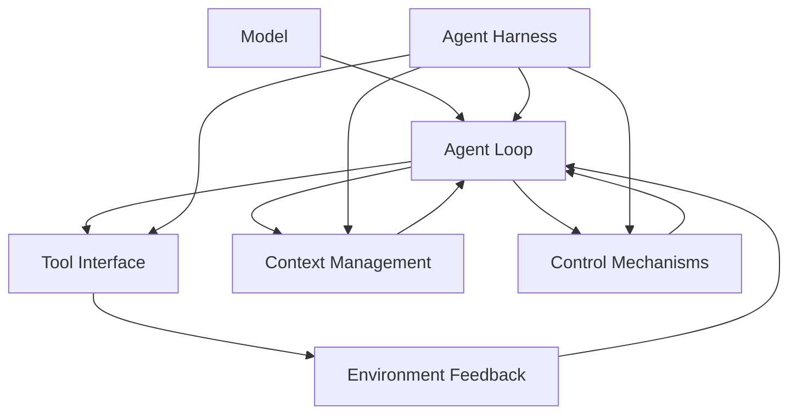

# “什么是 Agent Harness”知识积累小实战实施计划

> **For agentic workers:** REQUIRED SUB-SKILL: Use superpowers:subagent-driven-development (recommended) or superpowers:executing-plans to implement this plan task-by-task. Steps use checkbox (`- [ ]`) syntax for tracking.

**Goal:** 从 harness-engineering awesome reading list 的 Foundations 分区精选六个来源，形成“什么是 Agent Harness”的中文专题知识，并完成 PaperWiki 状态迁移、图谱入库和幂等验证。

**Architecture:** 以 reading list 中的稳定 `source_id` 为输入，先建立来源证据账本，再综合为一个 topic report 和权威 `record.json`。Topic deposit 以 record 为唯一结构化输入，生成 topic/source/concept/method 双向链接，并依据 reading list 的实时状态执行 `studied → deposited`。

**Tech Stack:** Python 3 标准库、PaperWiki CLI、Markdown、JSON、Mermaid、Obsidian wikilinks、现有 `scripts/render_report.py`。

## Global Constraints

- 核心来源固定为六个，不在执行中临时换源；不可访问来源必须标记 `blocked` 并保留证据缺口。
- 来源观点与综合判断必须明确分开；事实性主张必须带标题节、文件路径或论文页码/章节定位。
- 最小对比案例是基于来源的执行路径分析，不调用外部模型，不报告成功率或性能数字。
- 不创建六份独立深读报告，不实现新的 agent framework，不扩展到 compaction/eval/permissions 的专项综述。
- 不设置 `human_confirmed: true`，不把生成内容称为人工确认结论。
- 所有文件编辑使用 `apply_patch`；状态变更和入库使用 PaperWiki CLI。

## File Map

- Create: `reports/topic-what-is-agent-harness/report.md` — 中文专题正文、证据定位、概念地图和最小对比案例。
- Create: `reports/topic-what-is-agent-harness/record.json` — topic 身份、六个来源状态、实体和时间戳。
- Create: `reports/topic-what-is-agent-harness/report.html` — 由 Markdown 渲染生成的派生产物。
- Modify: `reading-lists/harness-engineering.json` — 六个来源的 `status`、`status_updated_at`，失败来源另含 `blocked_reason`。
- Create/Modify via deposit: `wiki/topics/agent-harness.md`, `wiki/sources/*.md`, `wiki/concepts/*.md`, `wiki/methods/*.md`, `index.md`, `log.md`。

---

### Task 1: 建立基线与固定来源集合

**Files:**
- Read: `reading-lists/harness-engineering.json`
- Read: `docs/superpowers/specs/2026-07-18-what-is-agent-harness-practice-design.md`
- Verify: `tests/test_ingest.py`, `tests/test_deposit_kinds.py`

**Interfaces:**
- Consumes: Foundations reading-list entries and their current statuses.
- Produces: Exact six-source snapshot used by Tasks 2–6.

- [ ] **Step 1: Verify the worktree and test baseline**

Run:

```powershell
git status --short --branch
python -m unittest discover -s tests
```

Expected: worktree has no uncommitted changes; `Ran 112 tests` and `OK`.

- [ ] **Step 2: Verify all six stable identities exist exactly once**

Run:

```powershell
@'
import json
from pathlib import Path

required = {
    "url:f6b93302265d",
    "url:ae10eb4597fe",
    "url:38c43325a50c",
    "url:7659f727e260",
    "url:33f520c0c534",
    "arxiv:2606.10106",
}
data = json.loads(Path("reading-lists/harness-engineering.json").read_text(encoding="utf-8"))
matches = [e for e in data["entries"] if e["source_id"] in required]
assert len(matches) == 6
assert {e["source_id"] for e in matches} == required
assert all(e["section_path"] == ["Foundations"] for e in matches)
for entry in matches:
    print(entry["source_id"], entry["status"], entry["title"], entry["url"])
'@ | python -
```

Expected: six unique lines, all in Foundations; initial status is recorded before any mutation.

- [ ] **Step 3: Record exact source roles for later synthesis**

Use this fixed mapping in all later artifacts:

```text
url:f6b93302265d    role=definition
url:ae10eb4597fe   role=runtime-loop
url:38c43325a50c   role=architecture-boundary
url:7659f727e260   role=component-anatomy
url:33f520c0c534   role=engineering-system
arxiv:2606.10106   role=constitutive-test
```

Expected: no source role is changed during reading; disagreements are represented in the report instead.

### Task 2: 阅读六个来源并建立证据账本

**Files:**
- Create later from evidence: `reports/topic-what-is-agent-harness/report.md`
- Create later from status: `reports/topic-what-is-agent-harness/record.json`
- Modify on failure only: `reading-lists/harness-engineering.json`

**Interfaces:**
- Consumes: Task 1 source snapshot.
- Produces: Per-source notes with claim, locator, interpretation, accessibility, and role.

- [ ] **Step 1: Read the three definitional and structural sources**

Open and read completely enough to capture the named sections:

```text
https://openai.com/index/harness-engineering/
https://blog.langchain.com/the-anatomy-of-an-agent-harness/
https://arxiv.org/abs/2606.10106
```

For each source record:

```text
source_id:
access_status: studied | blocked
source_claims:
  - claim:
    locator: heading or paper section/page
interpretation:
limitations:
```

Expected: OpenAI supports the discipline framing, LangChain supports component anatomy, and the paper supports the four-part inclusion test. If the paper full text is inaccessible, do not infer necessary-and-sufficient details from the list description alone.

- [ ] **Step 2: Read the three operational and engineering sources**

Open and read completely enough to capture the named sections:

```text
https://openai.com/index/unrolling-the-codex-agent-loop/
https://www.anthropic.com/research/building-effective-agents
https://martinfowler.com/articles/exploring-gen-ai/harness-engineering.html
```

Use the same evidence record shape. Expected coverage: runtime loop and feedback, workflow-versus-agent boundary, and context/constraints/entropy engineering model.

- [ ] **Step 3: Mark inaccessible sources immediately**

For each inaccessible source run exactly one matching line below; do not run a line for an accessible source:

```powershell
python paperwiki.py mark harness-engineering url:f6b93302265d --status blocked --reason "OpenAI Harness Engineering source could not be retrieved during the study"
python paperwiki.py mark harness-engineering url:ae10eb4597fe --status blocked --reason "OpenAI Codex agent loop source could not be retrieved during the study"
python paperwiki.py mark harness-engineering url:38c43325a50c --status blocked --reason "Anthropic Building Effective Agents source could not be retrieved during the study"
python paperwiki.py mark harness-engineering url:7659f727e260 --status blocked --reason "LangChain agent harness anatomy source could not be retrieved during the study"
python paperwiki.py mark harness-engineering url:33f520c0c534 --status blocked --reason "Martin Fowler harness engineering source could not be retrieved during the study"
python paperwiki.py mark harness-engineering arxiv:2606.10106 --status blocked --reason "arXiv 2606.10106 full text could not be retrieved during the study"
```

Expected: CLI exits 0 for a known ID and writes `blocked_reason`. Do not mark accessible sources yet.

- [ ] **Step 4: Audit evidence completeness before synthesis**

Check that every accessible source has at least two source claims with precise locators, one interpretation, and one limitation. Check that blocked sources have a concrete `blocked_reason` and appear in the planned source list.

Expected: no uncited claim is carried into Task 3.

### Task 3: 编写专题报告与权威 record

**Files:**
- Create: `reports/topic-what-is-agent-harness/report.md`
- Create: `reports/topic-what-is-agent-harness/record.json`

**Interfaces:**
- Consumes: Task 2 evidence records and live reading-list statuses.
- Produces: Topic report and record accepted by `cmd_deposit`.

- [ ] **Step 1: Create the report with the exact document contract**

Use `apply_patch` to create `report.md` with this structure and complete prose under every heading:

```markdown
---
topic_id: topic:agent-harness
kind: topic
list_slug: harness-engineering
status: studied
generated: true
human_confirmed: false
---

# 什么是 Agent Harness？

> [!summary] 一句话定义
> Agent harness 是包围模型的运行时控制层：它通过循环、工具接口、上下文管理和控制机制，把一次模型调用变成能够观察、行动、验证、恢复并受约束地完成任务的 agent 系统。

## 主题界定
## Harness、Model、Agent 与 Framework
## 四项构成判据
## 从构成到工程：上下文、约束与熵管理
## 概念地图
## 最小对比案例：给 Python CLI 增加输入校验
### 裸模型调用
### 带 Harness 的 Agent
### 对照表
## 六个来源的观点与证据
## 常见误区
## 实践启发
## 开放问题
## 刻意未纳入
## 来源清单
## User notes
```

Expected: the summary is retained verbatim; source claims use explicit locators; synthesis paragraphs are prefixed or worded as “综合判断”.

- [ ] **Step 2: Add the concept map and execution-path comparison**

The concept map must include this relationship without adding unsupported quantitative claims:



The comparison table must cover input context, iteration, tool feedback, state, permissions, verification, recovery, and completion criteria.

- [ ] **Step 3: Create record.json with exact schema fields**

Use `apply_patch` to create valid JSON shaped as:

```json
{
  "kind": "topic",
  "topic_slug": "agent-harness",
  "title": "Agent Harness",
  "list_slug": "harness-engineering",
  "sources": [],
  "entities": {
    "concepts": ["Agent Loop", "Context Engineering", "Control Mechanisms", "Entropy Management"],
    "methods": ["Deterministic Feedback", "Harness Decomposition"],
    "tools": []
  },
  "created": "2026-07-18T14:37:50.1690562+00:00",
  "updated": "2026-07-18T14:37:50.1690562+00:00"
}
```

Populate `sources` with all six objects and exact fields `source_id`, `title`, `url`, `source_type`, `role`, `status`. Values must come from the reading list and Task 2; the only allowed statuses are `studied` and `blocked`.

- [ ] **Step 4: Validate Markdown/JSON consistency**

Run:

```powershell
python -m json.tool reports/topic-what-is-agent-harness/record.json > $null
@'
import json
from pathlib import Path

root = Path("reports/topic-what-is-agent-harness")
report = (root / "report.md").read_text(encoding="utf-8")
record = json.loads((root / "record.json").read_text(encoding="utf-8"))
assert record["kind"] == "topic"
assert record["topic_slug"] == "agent-harness"
assert len(record["sources"]) == 6
assert len({s["source_id"] for s in record["sources"]}) == 6
assert all(s["status"] in {"studied", "blocked"} for s in record["sources"])
for heading in ["四项构成判据", "概念地图", "最小对比案例", "六个来源的观点与证据", "来源清单", "User notes"]:
    assert f"## {heading}" in report
assert "human_confirmed: false" in report
print("topic artifacts: ok")
'@ | python -
```

Expected: `topic artifacts: ok`.

- [ ] **Step 5: Commit the authored topic artifacts**

```powershell
git add reports/topic-what-is-agent-harness/report.md reports/topic-what-is-agent-harness/record.json reading-lists/harness-engineering.json
git commit -m "docs: study what makes an agent harness"
```

Expected: commit contains only the report, record, and any blocked-state changes.

### Task 4: 渲染报告并迁移 studied 状态

**Files:**
- Create: `reports/topic-what-is-agent-harness/report.html`
- Modify: `reading-lists/harness-engineering.json`

**Interfaces:**
- Consumes: Task 3 report/record and Task 2 accessibility results.
- Produces: Rendered HTML and live reading-list `studied|blocked` states.

- [ ] **Step 1: Render HTML from Markdown**

```powershell
python scripts/render_report.py reports/topic-what-is-agent-harness/report.md reports/topic-what-is-agent-harness/report.html
```

Expected: exit 0 and sibling `report.html` exists.

- [ ] **Step 2: Mark every accessible source studied in one atomic CLI call**

Construct the CLI invocation from record entries whose status is `studied` while still routing the mutation through `paperwiki.py mark`:

```powershell
@'
import json
import subprocess
import sys
from pathlib import Path

record = json.loads(Path("reports/topic-what-is-agent-harness/record.json").read_text(encoding="utf-8"))
source_ids = [source["source_id"] for source in record["sources"] if source["status"] == "studied"]
if source_ids:
    subprocess.run(
        [sys.executable, "paperwiki.py", "mark", "harness-engineering", *source_ids, "--status", "studied"],
        check=True,
    )
'@ | python -
```

Expected: output is `N/N entries -> studied`; blocked sources remain blocked with their reasons.

- [ ] **Step 3: Verify HTML and live statuses**

Run:

```powershell
@'
import json
from pathlib import Path

report_dir = Path("reports/topic-what-is-agent-harness")
assert (report_dir / "report.html").stat().st_size > 0
record = json.loads((report_dir / "record.json").read_text(encoding="utf-8"))
reading = json.loads(Path("reading-lists/harness-engineering.json").read_text(encoding="utf-8"))
live = {e["source_id"]: e for e in reading["entries"]}
for source in record["sources"]:
    assert live[source["source_id"]]["status"] == source["status"]
print("render and study states: ok")
'@ | python -
```

Expected: `render and study states: ok`.

- [ ] **Step 4: Commit rendered report and state changes**

```powershell
git add reports/topic-what-is-agent-harness/report.html reading-lists/harness-engineering.json
git commit -m "docs: render agent harness topic study"
```

### Task 5: 完整入库与双向链接验证

**Files:**
- Create/Modify: `wiki/topics/agent-harness.md`
- Create/Modify: `wiki/sources/*.md`
- Create/Modify: `wiki/concepts/*.md`
- Create/Modify: `wiki/methods/*.md`
- Modify: `index.md`, `log.md`, `reading-lists/harness-engineering.json`

**Interfaces:**
- Consumes: Task 4 topic artifacts and live statuses.
- Produces: Deposited topic graph and `deposited|blocked` final source states.

- [ ] **Step 1: Deposit the topic**

```powershell
python paperwiki.py deposit reports/topic-what-is-agent-harness/report.md --root .
```

Expected: prints `wiki/topics/agent-harness.md`; accessible sources transition from `studied` to `deposited`, blocked sources remain unchanged.

- [ ] **Step 2: Verify graph artifacts and reciprocal links**

Run:

```powershell
@'
import json
from pathlib import Path

root = Path(".")
topic = root / "wiki/topics/agent-harness.md"
text = topic.read_text(encoding="utf-8")
record = json.loads((root / "reports/topic-what-is-agent-harness/record.json").read_text(encoding="utf-8"))
assert "[[reports/topic-what-is-agent-harness/report|Agent Harness 综述]]" in text
for entity in ["agent-loop", "context-engineering", "control-mechanisms", "entropy-management"]:
    assert (root / "wiki/concepts" / f"{entity}.md").exists()
for method in ["deterministic-feedback", "harness-decomposition"]:
    assert (root / "wiki/methods" / f"{method}.md").exists()
for source in record["sources"]:
    source_page = root / "wiki/sources" / (source["source_id"].replace(":", "-") + ".md")
    assert source_page.exists(), source_page
    assert "Agent Harness" in source_page.read_text(encoding="utf-8")
print("topic graph: ok")
'@ | python -
```

Expected: `topic graph: ok`. If an identity slug differs because of general `slug()` normalization, inspect `wiki/sources/` and correct only the validation expression, not the generated identity.

- [ ] **Step 3: Verify final reading-list states**

Run a script that joins `record.json` to the live reading list. Expected: record `studied` sources are live `deposited`; record `blocked` sources are live `blocked` with non-empty `blocked_reason`.

- [ ] **Step 4: Commit deposited knowledge**

```powershell
git add wiki index.md log.md reading-lists/harness-engineering.json
git commit -m "docs: deposit agent harness knowledge graph"
```

### Task 6: 幂等性、回归与最终审计

**Files:**
- Verify: all files from Tasks 3–5
- Temporarily modify then restore through idempotent deposit: generated wiki and log artifacts

**Interfaces:**
- Consumes: Fully deposited topic.
- Produces: Evidence that repeated deposit is safe and the repository remains valid.

- [ ] **Step 1: Snapshot material page/link counts**

Record SHA-256 hashes for all generated pages except `log.md`, and count the exact topic backlink in each source/entity page. Save these values only in terminal output, not a repository file.

- [ ] **Step 2: Run deposit a second time**

```powershell
python paperwiki.py deposit reports/topic-what-is-agent-harness/report.md --root .
```

Expected: no duplicate topic, source, concept or method pages; no duplicate backlinks. `log.md` may gain one operation entry by design.

- [ ] **Step 3: Verify idempotency and preserve User notes**

Check:

```text
topic page count = 1
source page count for selected identities = 6
each topic backlink count per source/entity page = 1
each related entity link count in topic page = 1
User notes section still exists and retains any pre-existing text
```

If the second deposit only changed `log.md`, keep the audit entry. Any other unexpected diff blocks completion.

- [ ] **Step 4: Run full verification**

```powershell
python -m unittest discover -s tests
python -m py_compile paperwiki.py skills/read-source/scripts/verify_report.py
git diff --check
rg -n '^(<<<<<<<|=======|>>>>>>>)' reports/topic-what-is-agent-harness wiki reading-lists/harness-engineering.json
git status --short
```

Expected: 112 tests pass, compilation succeeds, no whitespace errors or conflict markers, and status contains only the deliberate second-deposit audit change if it was not committed earlier.

- [ ] **Step 5: Commit the idempotency audit if needed**

```powershell
git add log.md
git commit -m "docs: record agent harness deposit verification"
```

Skip this commit only when the second deposit produced no tracked diff.

- [ ] **Step 6: Produce the handoff summary**

Report: one-sentence harness definition, six source outcomes, generated report/wiki paths, reading-list status transitions, idempotency result, full-test count, commit list, and any blocked evidence gaps. Do not claim human confirmation.
