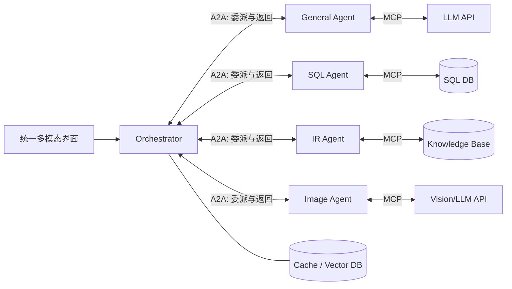

# AgentMaster：用 A2A 与 MCP 划清多智能体系统的通信边界

> **一句话结论。** AgentMaster 不训练任何模型，而是用中心协调器、A2A 式智能体消息和 MCP 式工具接口，搭出一个面向桥梁数据问答的多智能体原型；它的架构分层值得借鉴，但 23 个问题、6 个复杂案例和非独立的自验证，只能证明“能跑通”，不足以证明可扩展、容错或生产可用。

## 1. 论文定位与研究问题

- **论文**：Callie C. Liao, Duoduo Liao, Sai Surya Gadiraju. *AgentMaster: A Multi-Agent Conversational Framework Using A2A and MCP Protocols for Multimodal Information Retrieval and Analysis*。
- **版本**：arXiv:2507.21105；EMNLP 2025 System Demonstrations，DOI 10.18653/v1/2025.emnlp-demos.5。
- **模型与数据**：所有智能体使用 GPT-4o-mini；案例数据来自美国 FHWA 桥梁公开数据。
- **核心问题**：怎样把异构智能体间的协作与数据库、检索、图像及 LLM 等资源访问模块化，使一个自然语言入口可以自动分解、路由并合成跨模态答案？
- **训练需求**：无参数更新、无微调。工作全部发生在推理期，因此符合“应用起来不需要训练模型”的筛选条件。

这篇工作属于 **system demo / pilot study**，而不是提出新学习算法的 MARL 论文。它的贡献应主要按软件架构与接口设计评价，而不能只看摘要里的 96.3% BERTScore F1。

## 2. 最关键的设计：A2A 与 MCP 各管一条轴

论文最有迁移价值的判断，是把两类常被混在 prompt 里的通信拆开：

| 边界 | 论文中的职责 | 典型消息 | 工程收益 |
|---|---|---|---|
| A2A | 智能体—智能体：委派、协调、状态和结果返回 | Coordinator → SQL Agent；IR Agent → Coordinator | 角色可发现、可替换，协调逻辑不必理解每个工具内部细节 |
| MCP | 智能体—资源：工具、数据、上下文和长期状态访问 | SQL Agent → SQL DB；IR Agent → knowledge base | 工具接口从具体 agent prompt 中抽离，数据源可独立演化 |

论文的概念图（Figure 1，第 1 页）可压缩为：

这里的关键不是协议名本身，而是**控制面与数据面的解耦**：A2A 传任务语义和执行状态，MCP 暴露受约束的能力与资源。这样新增 agent 时只需声明能力和输入输出；新增数据源时无需重写协调器。

## 3. 四层通用框架与案例实现

### 3.1 四层结构

1. **统一会话界面**：接收文本、图像、图表、音频，输出文本、图像或结构化表。
2. **多智能体中心**：Orchestrator 位于顶层，下面是通用智能体和 SQL、IR、图像等领域智能体。领域智能体内部还可以继续管理子 agent。
3. **通信协议层**：A2A 负责结构化 JSON 消息和委派；MCP 负责工具、API、上下文资源与长期记忆。
4. **状态管理层**：向量数据库和上下文缓存保存本地或共享状态。

### 3.2 端到端执行

案例系统采用 Flask 微服务。Figure 2（第 3 页）给出实际链路：前端把文本/图像交给 Flask；Coordinator 先做复杂度判断；简单问题直接路由到一个 agent，复杂问题先拆成子问题，再把每项送给 General、SQL、IR 或 Image agent；各 agent 经 MCP server 访问资源，结果返回 Coordinator 合成。

可以把这一流程写成一个**本文分析所用的工程形式化**（不是论文提出的训练目标）：

$$
q \xrightarrow{g_{complex}} \{q_i\}_{i=1}^{n},\quad
a_i=f_{r(q_i)}(q_i;\mathcal T_{r(q_i)}),\quad
y=s(q,a_1,\ldots,a_n)
$$

其中 $g_{complex}$ 判断是否拆分，$r$ 选择 agent，$\mathcal T$ 是该 agent 通过 MCP 可见的工具集合，$s$ 是最终合成器。这个表示也暴露了四个独立故障点：误判复杂度、错误拆分、错误路由和错误合成。

### 3.3 一个跑通的例子

Figure 3（第 4 页）询问：“简要定义 bridge，再给出 Virginia 桥梁总数和 2019 年建造的桥梁。”Coordinator 拆成三个问题，分别路由 General、SQL、SQL，最终把定义、计数 758 和列表合并。该图同时用单独提交子问题的方式检查复杂答案的片段。

这能说明路由链路可工作，却不是严格的端到端正确性证明：验证问题仍交给同一个 AgentMaster、相同模型和相同数据库，误差高度相关，并非独立 ground truth。

## 4. 实验到底证明了什么

### 4.1 数据与指标

测试集只有 **23 个问题**，涵盖 SQL、IR、通用问答和图像/复杂问答；其中论文展开了 6 个复杂问题。所有 agent 均使用 GPT-4o-mini。指标包括 G-Eval（LLM-as-a-Judge）、BERTScore Precision/F1，以及文中笼统提到的人类评价和 agentic metrics。

| Query type | G-Eval | BERT Precision | BERT F1 |
|---|---:|---:|---:|
| SQL | 92.0 | 98.8 | 98.7 |
| IR | 90.2 | 97.6 | 97.8 |
| General QA | 84.0 | 95.7 | 96.8 |
| Image / Complex QA | 82.0 | 90.1 | 91.9 |
| 平均 | **87.1** | **95.6** | **96.3** |

Table 1（第 6 页）显示 6 个复杂问题被拆成 2–8 个子问题；Q6 全部路由为 8 个 IR 调用。这说明动态拆分会迅速放大调用次数，但论文没有同时报告 token、美元成本或耗时。

### 4.2 可以支持的结论

- 原型能把复合问题自动分解并路由到多类 agent。
- 结构化 SQL/IR 的语义相似度高于开放式与复杂问答，这符合任务可约束程度的差异。
- A2A/MCP 双边界是一种可实现的模块化组织方式。
- 无需训练即可接入现有 LLM、数据库和检索服务。

### 4.3 不能由实验支持的结论

- **不能证明可扩展**：没有并发量、agent 数、数据规模或负载曲线。
- **不能证明容错**：没有 agent 掉线、超时、损坏消息、工具失败或重试实验。
- **不能证明更优**：Table 3 是作者填写的功能特性表，不是 MAS-0、A2A-only、MCP-only 的受控消融结果。
- **不能证明协议互操作**：没有用第三方 A2A agent/MCP server 做 conformance 或跨实现测试。
- **不能证明成本有效**：未报告端到端 token、延迟、吞吐或 API 花费。
- **不能证明评价可靠**：23 题过小，未报告多次运行方差；人评缺少人数、rubric、盲评和一致性。

因此，96.3% BERTScore F1 应读作“与内部参考答案语义相近”，而不是 96.3% 的真实任务成功率。

## 5. 附录暴露出的具体失败

附录后台日志比主文的平均分更有诊断价值。

1. **Q3 SQL 能力判断自相矛盾**：系统先说平均桥龄“无法用单条 SQL，因为需要 aggregate”，随后另一个 SQL 子任务却使用 `AVG(bridge_age)` 子查询。这表明路由和能力判断并不稳定。
2. **Q5 语义没有完全落到查询中**：查询用 `year_built < 1970 ORDER BY year_built ASC LIMIT 5` 找旧桥，但“仍在使用”没有变成状态过滤条件；General agent 提供的意义解释也无法补上数据约束缺失。
3. **Q6 拆成八次 IR**：对长复合问题直接按片段扇出，可能重复检索、提高成本，也可能让最终合成丢失跨子问题约束。

这些例子提示：一个完整系统至少要记录 `decomposition → routing → tool call → evidence → synthesis` 的可追踪链，而不是只展示最终答案。

## 6. 与当前 A2A/MCP 标准的关系

论文明确把 AgentMaster 描述为 **self-implemented A2A and MCP**，并说明具体应用也可以采用 Google A2A SDK。应避免把论文中的 JSON-RPC 调用直接等同于今天完整的标准实现。

当前 A2A 规范已包含 Agent Card、任务生命周期、版本协商等互操作语义；MCP 则明确采用 host–client–server 架构及协议版本协商。论文没有逐项给出消息 schema、能力发现、版本协商、认证授权、任务取消或错误语义测试。因此更准确的判断是：

> AgentMaster 验证了“A2A 负责横向协作、MCP 负责纵向工具访问”的架构思想，但没有验证其自实现与外部生态的协议一致性。

若今天落地，应优先用官方 SDK/规范边界实现，并把论文的 Coordinator 与 agent 划分映射进去，而不是复制其私有 JSON 格式。

## 7. 无训练落地：最小可用版本

### 7.1 推荐步骤

1. 只定义 `Coordinator + 2 个领域 agent`，例如 SQL 与文档检索；不要一开始建立过多角色。
2. 给每个 agent 发布能力卡：输入 schema、输出 schema、工具权限、超时、价格等级和数据敏感级别。
3. 工具全部经 MCP 暴露；SQL 只允许只读账号、参数化/白名单查询和行数上限。
4. Coordinator 输出结构化计划：`subtask_id / depends_on / assigned_agent / success_criteria`。
5. 每个返回值必须携带 evidence 与 provenance；合成器不得把无证据的自由生成覆盖工具结果。
6. 简单请求绕过多 agent；仅在确需跨源组合时分解，并限制最大子任务数和预算。
7. 记录任务成功率、p50/p95 延迟、总 token、工具错误、路由错误和人工接管率。

### 7.2 必须补齐的安全控制

- A2A：agent 身份认证、最小权限、消息签名/审计、超时与取消、幂等键。
- MCP：server allowlist、工具参数校验、secret 隔离、数据库只读、输出内容净化。
- Prompt injection：工具返回与用户指令分区，禁止检索内容提升权限或改变系统策略。
- 状态：租户隔离、TTL、敏感信息脱敏、可删除性和访问日志。
- 合成：SQL/检索事实优先，冲突证据显式展示，低置信度触发人工确认。

## 8. Five Ws 映射

| W | AgentMaster 的回答 | 证据强度 |
|---|---|---|
| Who | Coordinator、General、SQL、IR、Image agents | 中：系统实现清楚，规模很小 |
| Whom | 中心化星形通信，领域 agent 经 Coordinator 协作 | 中：案例可见，无拓扑消融 |
| What | 子问题、任务类型、结构化结果、证据与最终合成 | 中：日志充分，但 schema 未完整公开 |
| When | Coordinator 先判断简单/复杂，再决定直达或分解 | 弱：误分类已被作者承认，无阈值/校准 |
| How | A2A 管 agent 协作，MCP 管工具/上下文访问 | 中偏弱：架构明确，无标准一致性测试 |

## 9. 局限、复现性与开放问题

### 9.1 作者承认的局限

- 准确率受底层 LLM 与检索语料限制。
- 复杂度误判会产生不必要分解或不完整答案。
- 有限的 agent 协作与受限数据库会让回答浅薄，复杂信息合成困难。
- LLM judge 存在偏差、领域知识不足和人类对齐问题。
- 系统缺乏成熟的信息存储与使用安全防护。

### 9.2 进一步的审稿式局限

- 未找到作者提供的公开代码仓库，无法核对实现与复现实验；论文只提供演示站点/视频。
- 单一 GPT-4o-mini、单一桥梁领域、极小样本，外推性很弱。
- 没有无 agent、单 agent、A2A-only、MCP-only 的数值基线。
- BERTScore 容易奖励语义相似而忽略精确数值、SQL 条件和证据正确性。
- “人类评价为 gold standard”与实际人评协议之间缺乏可审计细节。
- 无安全、隐私、权限边界和恶意输入评测。
- 论文没有数学算法或训练目标；本文未为了满足形式而虚构公式，前述表达仅是对工程管线的分析性形式化。

### 9.3 值得继续追问

1. 用官方 A2A/MCP SDK 替换自实现后，第三方 agent/server 的互操作成功率是多少？
2. 复杂度路由如何基于预算、风险和不确定性校准，而不只是一次 LLM 分类？
3. 子任务之间有依赖时，怎样表示 DAG、共享证据并避免并行调用破坏约束？
4. 在相同准确率下，相比单 agent tool-use，AgentMaster 增加多少 token、延迟和故障面？
5. 能否用可执行验证器替代同系统“把子问题再问一次”的循环验证？

## 10. 最终评价

如果目标是快速搭一个无需训练的领域多智能体应用，AgentMaster 值得读，尤其是它对 A2A/MCP 职责边界和 Coordinator 路由链的展示。若目标是选择一个经严格验证的多智能体算法，它不是最强证据：MARS 对 token 节省的实验更扎实，MOC 对通信压缩的机制更明确。

最适合带走的不是“AgentMaster 已经可扩展、容错”，而是一条工程原则：**先稳定 agent 与工具的协议边界，再讨论增加多少 agent；协议模块化不等于系统有效性，后者仍必须用端到端任务成功率、成本、延迟、故障和安全实验验证。**

## 精读补充（PaperForge 视角）

> [!note] 关于这一节
> 这一节用 PaperForge 的读法，补上第一遍精读没怎么展开的角度：作者是怎么想到这套架构的、整篇真正押在哪一条假设上、怎么花一周把它证伪、最强的反例长什么样、以及顺着缺口能做的一个新方向。它是接着往深里读，不是给论文打分。凡是论文没明说、属于我推断或猜测的地方，文中都会讲明。

### 作者是怎么走到这套架构的

论文没讲思路怎么来的，但只用 2025 年中之前的背景，能还原出一条挺直的路。

2024 到 2025 年，agent 框架一下子多起来——AutoGen、CrewAI、LangGraph 之类——它们的共同毛病是把协作逻辑、工具调用、上下文管理全揉在 prompt 里，换个工具或加个 agent 就要动一大片。差不多同时，2025 年冒出两个还很新的标准：Google 的 A2A 管 agent 之间怎么发现和委派，Anthropic 的 MCP 管 agent 怎么访问工具和数据。这两个 spec 各自的适用范围其实是正交的，一个横向（agent 对 agent），一个纵向（agent 对资源）。

手上正好有一份 FHWA 公开桥梁数据、又同时读过这两个 spec 的团队，最自然的下一步不是去发明新算法，而是挑一个具体的垂直场景，把"A2A 管横向、MCP 管纵向"这条拆分演示出来能不能跑通。这也解释了为什么它是一篇 system demo 而不是方法论文：核心动作是"读懂两个 spec 的边界，再找个真实场景验证组织方式"，不需要任何参数更新。这条链条没用到论文自己的结论当前提，是可复现的重建——当然，作者真实的动机未必如此。

### 整篇真正押在哪一条假设上

报告在"不能由实验支持的结论""附录失败""审稿式局限"里已经列了一长串问题。想再收紧一句：这套架构真正承重的，是一条几乎没被单独拎出来的假设——一个没经训练的 LLM 协调器，能可靠地判断复杂度、拆分子问题、并把每个子问题路由到对的 agent。用报告第 3 节那个形式化的话说，整套系统的价值全压在协调器那几步（要不要拆、选哪个 agent、最后怎么合成）都做对上。

A2A/MCP 的边界再干净，也只是把"能力"摆好；真正决定答案对不对的，是协调器这一次 LLM 判断。而论文自己的附录已经在拆这个台：Q3 里系统先说平均桥龄"没法用单条 SQL"，转头另一个子任务又用了 `AVG` 子查询；Q5 把"仍在使用"这个语义丢在了查询之外；Q6 直接扇出八次 IR。这些不是边角料，恰恰是承重假设在裂。论文没有把"路由和拆分本身的正确率"单独测出来，它被最终的 BERTScore 盖住了，而 BERTScore 只看语义像不像，不看拆分对不对。

### 花一周就能把这条假设证伪的实验

不用碰模型，也不用扩系统，只要把"协调器判断"从"最终答案质量"里拆出来单独测。

- 数据：把那 23 题扩到 60–80 题，每题人工标一份"正确的分解加正确的路由"当独立 ground truth（这跟最终答案对不对是两回事）。
- 做法：只跑协调器那一步，记录它的复杂度判断、拆出来的子问题、每个子问题选了哪个 agent，再和人工标注对比。
- 量三件事：复杂度判断准确率、分解正确率（有没有漏约束、有没有多拆）、路由准确率；再顺便和"单个 GPT-4o-mini 直接带工具、不拆"的基线比最终成功率。
- 判定：如果这三项里有一项明显掉，而且掉的地方正好对应最终答案出错，那"干净的协议边界能撑起可靠系统"就被证伪了——瓶颈不在边界，在那次没被单独测过的 LLM 判断。

这正是论文最该做、却被平均分掩盖掉的一次拆解。

### 如果要反驳，最强的反例长什么样

最狠的反例，是找一类查询，让"把子问题独立扇出去"这件事本身就是错的。

论文的路由默认子问题之间相互独立（Q6 一口气扇出八次 IR 就是这假设的极端）。但很多真实问题是有依赖的：第二步要用第一步的结果，或者几个子问题共享一个必须一致的约束。举个具体的："找出弗吉尼亚州 1970 年前建、当前评级低于某阈值、且仍在服役的桥，按风险排序。"这里"仍在服役"和"评级阈值"是必须一起落到同一条查询上的联合约束，一旦被拆成独立子任务分别路由，跨子问题的约束就丢了，这正是 Q5 已经露出的毛病，只是被放大。

这个反例的杀伤力在于：它不是说系统某道题答错，而是说架构的核心动作（分解加独立路由）在依赖型查询上会系统性地丢约束，而干净的 A2A/MCP 边界一点忙都帮不上——边界解耦的是"谁调用谁"，解耦不了"约束必须联合满足"。换句话说，模块化在这里恰恰是负担：它鼓励你把本该一起解的东西拆开。

### 顺着缺口，一个值得做的新方向

顺着上面那条缺口——协调器是个不可靠、又没被单独验证的单点——一个不增量的方向是：把协调器从"推理时一次 LLM 拍板"改成"先合成一份可静态检查的带类型计划，再执行"。

- 它针对的缺口：现在 A2A 消息里传的是自由格式 JSON，计划对不对只能等跑完看答案。报告第 9.3 节已经问到 DAG 表示和可执行验证器，但那还是把它们当补丁；这里要更进一步，把"计划本身"变成一等公民。
- 能借的相邻领域：program synthesis、design-by-contract、以及协议里的 session types。让协调器产出的不是 prompt，而是一份带类型的子任务 DAG——每个节点声明前置条件、后置条件、依赖、预算和成功判据；A2A 消息携带的是契约（谁保证什么），不是裸 JSON。执行前先做静态检查：约束有没有被拆散、依赖有没有成环、某个 agent 的输出类型对不对得上下游的输入。
- 第一个实验：拿一批依赖型查询（就用上面那种联合约束的题），比较两条路线——原版的"LLM 直接扇出"，对上"先合成带契约的 DAG、静态检查通过再执行"。看后者能不能在依赖型查询上把"丢约束"的错误压下去，代价是多少延迟。做成了，多智能体系统就从"prompt 里赌一次"变成"编译期能拦住一部分错误"。

和已有工作划界：这不是再包一个 orchestrator 框架（AutoGen/LangGraph 那类运行时还是靠 LLM 编排），也不是论文说的换官方 SDK（那解决的是互操作，不是计划正确性）；它把"协调器的计划"变成可以在执行前被检查的对象。风险也得说在前头：把计划形式化到什么粒度才既能查错、又不至于把 LLM 的灵活性掐死，这个度需要试。

## 参考入口

- 论文：<https://arxiv.org/abs/2507.21105>
- ACL Anthology：<https://aclanthology.org/2025.emnlp-demos.5/>
- A2A 最新规范：<https://a2a-protocol.org/latest/>
- MCP 2025-06-18 架构规范：<https://modelcontextprotocol.io/specification/2025-06-18/architecture>
