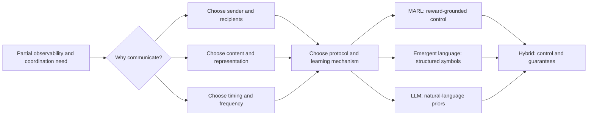

# The Five Ws of Multi-Agent Communication: Who Talks to Whom, When, What, and Why -- A Survey from MARL to Emergent Language and LLMs

> [!summary] 一句话结论
> 这篇 143 页综述的真正价值不是罗列约 400 篇论文，而是把多智能体通信重写成一组相互制约的设计决策：谁对谁说、说什么、何时说、为什么说，以及如何把动机落实为协议。MARL、涌现语言与 LLM 并非线性替代关系，而是在控制可验证性、语义结构、开放域泛化之间移动权衡；作者因此主张用受协议约束的混合系统连接高层语言协作与低层学习控制。

## 论文信息

- 作者：Jingdi Chen, Hanqing Yang, Zongjun Liu, Carlee Joe-Wong
- 年份：2026
- Venue：Transactions on Machine Learning Research (TMLR)
- 原文：https://arxiv.org/abs/2602.11583

## 研究问题

能否用同一套 Five Ws 分析框架统一解释 MARL 中的奖励驱动消息、涌现语言中的离散符号协议，以及 LLM 多智能体系统中的自然语言协作，并由此提炼跨范式的设计规律、失效模式和混合架构方向？

## 核心贡献

- 以 Five Ws 为统一坐标系组织 MARL-Comm、Emergent Language 和 LLM-Comm，避免三个社区各用一套术语讨论相似的路由、内容、时机和目标问题。
- 把通信追溯到 speech act 与 decentralized control：消息不是被动的数据搬运，而是改变他者信念、行动与未来系统轨迹的决策变量。
- 用显式 bridge 章节解释范式迁移：MARL 的不透明和任务绑定推动 EL，EL 的语义贫乏、训练成本和伙伴泛化问题推动 LLM，LLM 的弱 grounding 与无控制保证又推动混合 LLM-MARL。
- 整理约 400 项工作，其中约 100–130 项进入详细 taxonomy 和比较表，覆盖通信内容、接收者、时机、训练框架、协议结构、应用与 benchmark。
- 提出以理论保证、算法、统一 benchmark 和人类中心通信为四条未来路线，并强调混合系统应让语言承担高层规划/协商、让 MARL 承担低层控制/一致性。

## 方法直观解释

作者采用结构化文献综述：检索截至 2024 年 8 月的工作，以 Google Scholar 关键词检索、NeurIPS/ICML/ICLR/AAAI/AAMAS 及相关 workshop 人工检查、前后向引文追踪组合获取候选；以通信是否为核心、多决策主体、是否有方法/实证/形式框架和技术实质为纳入条件。分析层面先把通信建模为 Dec-POMDP 中附加的消息动作：发送者由局部观测和内部状态生成消息，接收者集合定义路由，聚合器形成通信上下文，策略再基于局部观测与消息行动。随后分别在 MARL、EL、LLM 三个范式中沿 who/whom/what/when/why/how 编码代表方法，并通过桥接表比较前一范式的缺口如何塑造下一范式。

## 1. 不要把 Five Ws 当成目录：它其实是一张因果图

标题中的 “Five Ws” 看起来像五个并列问题，论文正文却透露出更强的主张：**why 是上游变量，who/whom、what、when 与 how 是把目的落实为系统的下游选择**。如果通信的目的只是补齐局部观测，那么消息应接近状态摘要，接收者应是能利用该状态的邻居，时机应贴近决策边界；如果目的变成纠正推理，内容就会变成论证与批评，协议也会从单次广播变成 proposal–critique–revision 循环；如果目的变成混合动机博弈，隐藏、延迟、欺骗甚至拒绝发送也都是通信策略的一部分。

因此，Five Ws 的最佳用法不是给论文贴五个标签，而是在设计前按顺序追问：系统的不确定性来自哪里？一条消息通过哪条因果路径改善回报或可靠性？谁拥有这条信息？谁能用它改变行动？信息何时过期？最后才选择向量、符号、自然语言、图消息或工具调用。论文第 110 页把通信和行动显式错开一个时间步，正是为了避免“当前消息依赖当前动作、当前动作又依赖当前消息”的循环定义。

## 2. 共同数学骨架：消息是控制动作，不是聊天记录

在 cooperative Dec-POMDP 中，论文将带通信的系统写为：

$$
\mathcal D=\langle \mathcal S,\mathcal A,P,\Omega,O,\mathcal I,n,R,\gamma,f\rangle.
$$

这里 $\mathcal I=\{1,\ldots,n\}$ 是 agent 集合，$\mathcal S$ 是联合状态，$\mathcal A=\prod_i\mathcal A_i$ 是联合动作空间，$P$ 和 $R$ 分别给出状态转移与回报。人话解释：通信不是模型外部的附属 API，而是部分可观测控制问题内部、会改变联合策略结果的一类动作。

第 $i$ 个 agent 根据局部观测 $o_i$ 与内部历史 $h_i$ 生成消息：

$$
m_i=f_i(o_i,h_i),\qquad f_i:\mathcal O\times\mathcal H\rightarrow\mathcal M.
$$

人话解释：what 由 $f_i$ 决定；它可以输出原始观察、隐藏向量、意图、价值估计、离散符号或自然语言。表示空间 $\mathcal M$ 越自由，表达力通常越高，但带宽、可解释性和验证成本也越难控制。

agent 不必接收所有人的消息。令 $\mathcal N_i$ 为它的动态发送者集合，则通信上下文为：

$$
c_i=g_i\big(\{m_j\}_{j\in\mathcal N_i}\big).
$$

人话解释：whom 与 how 在这里耦合。$\mathcal N_i$ 是路由，$g_i$ 是聚合；全平均对应 CommNet 式广播，attention 对应 TarMAC 式相关性加权，图结构对应局部或动态邻居，代表 agent 则把群体信息先压缩再转发。

最终动作由局部观测和通信上下文共同决定：

$$
a_i\sim\pi_i(o_i,c_i).
$$

人话解释：一条消息是否“有意义”，不能只看它是否像人话，而要看它是否通过 $c_i$ 改变 $\pi_i$ 的行动分布并改善任务目标。这也是论文把 speech act 理论映射到 learned message action 的关键：通信是 **“communication as action”**，意义来自它造成的行为后果。

对于显式 attention 路由，论文给出代表性聚合：

$$
c_i=\sum_{j\ne i}\alpha_{ij}m_j,\qquad
\alpha_{ij}=\operatorname{softmax}(u_i^\top W u_j).
$$

人话解释：系统不再假设每条消息等价，而是让接收者根据当前表征分配注意力。这缓解冗余，却没有自动解决可信度：多个 agent 共享同一偏差时，高相关性可能只是高相关错误。

## 3. 三次范式迁移：每一步都获得一种能力，也丢掉一种保证

### 3.1 MARL：语义由回报赋予

MARL-Comm 的中心优势是消息、行动与回报可以端到端联合优化。CommNet 用全体隐藏状态平均形成共享上下文；DIAL/RIAL 把显式通信纳入学习；IC3Net 学习何时开口；TarMAC 用 attention 选择接收者；ATOC 建立动态通信组；SchedNet 和 IMAC 则把带宽与信息压缩加入目标。Figure 3（第 16 页）把这条路线概括为 relevance filtering、past/future knowledge、representative/nearby/other agents、bandwidth scheduling 和多种 aggregation。

问题也来自同一机制。只要某个连续向量能提高共同回报，训练就会保留它，并不要求它对应人类概念、能被新伙伴理解或在新任务中复用。Table 7（第 47 页）因此把 MARL 的核心瓶颈概括为 opaque、non-transferable signals。换句话说，MARL grounding 很强——消息被环境回报约束；可读语义却弱——人不知道信号“说了什么”。

### 3.2 Emergent Language：把协议结构本身变成研究对象

EL 不满足于“向量能协作”，而追问离散符号、词汇、句法与组合结构怎样从互动中出现。Figure 8（第 49 页）显示其分析单元从 population size 和 communicative role，一直延伸到 vocabulary、multi-step dialogue、compositionality、environment、interpretability、robustness 与 generalization。评价也不再只有任务成功率，还包括 topographic similarity、context independence、message entropy、互信息、zero-shot partner success 等。

但离散不等于自然语言，组合性指标也不等于真实可迁移语义。EL agent 往往在特定 reference game、signaling game 或 grid world 中从零共训；换环境、换伙伴或扩大群体后，约定容易失效。Table 11（第 71 页）所表达的迁移动机是：EL 比连续 MARL 消息更有结构，却仍缺少足以支撑开放域推理、跨任务迁移和人机协作的语义先验。

### 3.3 LLM：直接继承语言先验，但控制 grounding 变弱

LLM agent 不必从零发明词汇。预训练已经提供丰富、组合、可读的公共接口，使 chain、decentralized debate、hierarchy、centralized coordinator 与 heterogeneous team 都能用 prompt 快速搭建。Figure 11（第 72 页）同时提醒，拓扑只是系统的一部分；memory/context、tools、agent configuration、message structure、static/dynamic policy 共同决定通信行为。

自然语言带来的“表面可解释性”很容易被高估。消息可读，不表示它忠实对应环境状态；承诺听起来合理，不表示后续策略会执行；多个 agent 达成共识，不表示共识正确。Table 19–20（第 107–108 页）把缺口具体化为 grounding/state alignment、temporal coherence、scalability、lack of guarantees 和 hard-to-detect failures。论文用 **“open-ended language generation”** 指出它与去中心化控制假设之间的根本张力。

## 4. 横向比较：三种通信不是替代品

| 维度 | MARL-Comm | Emergent Language | LLM-Comm |
|---|---|---|---|
| 语义来源 | 环境互动与回报 | 任务互动中形成的群体约定 | 大规模预训练语言先验 |
| 典型消息 | 连续隐藏向量、状态/意图编码 | 离散符号、有限词汇、组合消息 | 自然语言、结构化文本、工具调用 |
| 最强能力 | 与控制目标联合优化 | 可研究协议结构与组合性 | 开放域表达、推理、人机互操作 |
| 主要 grounding | 强：直接受状态和回报约束 | 中：受窄环境约束 | 弱到中：常依赖文本摘要或工具反馈 |
| 主要失效 | 不透明、任务绑定、伙伴不兼容 | population-specific、从零训练、语义贫乏 | 幻觉、承诺—动作不一致、token/延迟成本 |
| 最适位置 | 低层控制、事件触发、稀疏状态交换 | 协议学习、组合性与社会约定研究 | 高层规划、协商、批评、人与 agent 接口 |

这张表揭示一个重要反直觉：LLM 并不天然位于“通信能力”的终点。它改善的是表达与先验，却可能在控制相关信息的最小性、可靠性和可验证性上退步。作者最终提倡的不是全语言化，而是把三种机制按层组合。

## 5. Why 决定 How：四个混合系统为什么不能套同一模板

Table 18（第 105 页）是全篇最值得工程团队抄走的表。Cicero 面对长程联盟和承诺，语言必须与未来策略一致，所以 RL 用于约束承诺可执行；Werewolf 面对隐藏身份与欺骗，语言是概率性的信念信号，RL 用来选择何时透露、扭曲或保留信息；FAMA 面对部分可观测的协作执行，语言承担状态与意图摘要，集中式 MARL 更新负责功能对齐；ACC-Collab 面对推理错误，通信成为 actor–critic 式 proposal–critique 循环。

| 主要不确定性 | Why | 合适的消息功能 | 必要约束 |
|---|---|---|---|
| 长程战略与联盟 | 建立可信承诺 | negotiation / commitment | message–action consistency |
| 隐藏角色与对抗 | 改变或推断信念 | selective signaling | 对手建模、披露策略、欺骗审计 |
| 局部观测与联合执行 | 补齐状态、同步意图 | structured state/intent summary | 状态接口、低延迟、控制回报 |
| 推理路径不可靠 | 暴露并纠正错误 | proposal–critique–revision | 角色分离、停止条件、证据核验 |
| 人机协作 | 对齐目标与解释行动 | readable plan / clarification | 权限、可追溯性、用户适配 |

所以，论文把 hybrid communication 概括为 **“reward-shaped, protocol-constrained mechanism”**。真正的混合不是“给 MARL agent 加一个聊天框”，而是明确哪类语言行为由 LLM 生成，哪类选择由 RL 优化，哪些约束由形式规则或 verifier 执行，以及失败时由哪个低层通道接管。

## 6. When：从一直说话到价值感知通信

早期系统常在每个时间步全广播，这在小规模仿真中方便，却会让通信量随 agent 数快速增长，也把无关或过时信息混进策略。IC3Net 的 gate、ETCNet 的事件触发、ATOC 的协作前预测、SchedNet 的带宽调度都说明：when 不是工程优化，而是策略的一部分。消息太早可能没有信息，太晚可能已无法改变动作；频率太高增加成本和共适应，太低则无法修复局部观测。

LLM 系统里的对应问题是 static 与 dynamic protocol。固定 pipeline、固定轮数 debate 和软件工程 workflow 可复现、易调试，却难以回滚上游错误；动态 dialogue、具身 action-timed communication 和自组织拓扑能响应不确定性，却需要 message filtering、memory management、convergence 与 stopping rule。Table 16（第 98–99 页）最重要的结论不是二选一，而是按任务阶段、风险和不确定性在静态与动态之间切换。

## 7. 论文给出的理论议程

作者用集中式最优策略与通信受限策略的回报差来定义通信代价：

$$
\Delta J=J^*(\pi)-J(\pi_C).
$$

人话解释：通信研究最终应回答“带宽或协议限制让系统损失多少”，而不只是报告一个新模块把 benchmark 提高了几点。

进一步可把协议选择写成约束优化：

$$
\min_{\pi_C}\sum_{t=1}^{T}C_t
\quad\text{s.t.}\quad
J^*(\pi)-J(\pi_C)\le\epsilon.
$$

人话解释：在可接受的性能损失 $\epsilon$ 内，寻找总通信成本最低的策略。这里的 $C_t$ 应同时覆盖字节、token、延迟、能耗和同步等待，而不应只数消息条数。

对于 emergent language，论文建议用信息瓶颈表达“有信息但要简洁”：

$$
\max_{\pi_C} I(m;s)
\quad\text{s.t.}\quad H(m\mid s)\le\delta.
$$

人话解释：消息 $m$ 要保留关于状态 $s$ 的信息，同时避免无约束地变长或随机。这个目标仍不能自动保证人类可解释性，但为效率、稳定性与组合性分析提供了共同起点。

## 8. 如何正确读这篇综述的“证据”

这不是一篇提出新模型的实验论文。作者没有在 MPE、SMAC、GRF、Hanabi、Overcooked 或 Melting Pot 上用相同预算重跑 MARL、EL 与 LLM 方法，也没有证明某一范式统一优于另一范式。论文最可靠的证据是概念整合、代表方法 taxonomy、桥接表与问题清单；“混合架构是方向”属于由这些证据支持的设计推论，不是统一对照实验的因果结论。

Section 4 的透明度也只能算中等。作者说明了 Google Scholar、主要会议、workshop、引文追踪、纳排标准、截止日期和停止规则，却没有公开完整查询、筛选流水线或机器可读语料。尤其是文献范围声称截止 2024 年 8 月，正文又讨论多项 2025 年工作；合理推测是 TMLR 修订时增补了新文献，但缺少版本化更新说明。因此，约 400 篇与 100–130 篇深读应视为覆盖规模，而不是可独立复算的统计量。

## 实验与证据

- 本文是 survey，没有提出新算法，也没有训练模型、统一复现实验或统计显著性检验；其证据主要来自结构化检索、约 400 篇文献的定性综合和 20 张 taxonomy/比较表。
- Section 4 报告文献搜索覆盖截至 2024 年 8 月，详细讨论约 100–130 篇代表论文；作者没有给出精确 PRISMA 流程、去重数量、逐阶段排除数或审稿者一致性。
- MARL 部分比较 CommNet、DIAL/RIAL、IC3Net、TarMAC、ATOC、SchedNet、IMAC 等，按消息内容、接收者、编码/聚合、触发时机和训练架构组织。
- EL 部分综合 population/role、合作关系、词汇与消息结构、多轮互动、compositionality、grounding、robustness 和 partner generalization 等评价维度。
- LLM 部分比较 chain、decentralized、hierarchical、centralized 和 heterogeneous topology，单轮/多轮/具身通信，以及 static/dynamic protocol，并列举 AutoGen、CAMEL、MetaGPT、ChatDev、Cicero、FAMA、ACC-Collab 等系统。
- Table 17–20 用 hybrid case study 和 decentralized-control desiderata 对照 LLM 的 grounding、时序一致性、效率、保证与难检测错误。

## 主要发现

- Five Ws 不是五个可独立调参的旋钮：why 是因，决定 what/when/whom/how；例如减少部分可观测性偏向状态摘要和高频局部通信，纠错偏向多轮 critique，战略博弈则偏向选择性披露、延迟或欺骗。
- MARL 的优势是消息与回报、状态转移和控制策略联合优化，弱点是连续 latent protocol 难解释、难迁移且常假定高带宽；注意力、门控和事件触发是从全广播向价值感知通信的演进。
- EL 把协议本身变成研究对象，以离散符号、组合性和群体一致性换取更好的结构，却仍常在窄任务中从零训练，容易形成 population-specific convention 和 zero-shot partner failure。
- LLM 通过预训练直接获得可读、可组合、开放域的自然语言接口，适合规划、辩论、协商和人机协作，但表面可解释性不等于控制层可解释性；语言可能脱离真实状态、承诺与动作不一致。
- LLM-MARL 混合系统没有统一模板：Cicero 把语言当承诺，Werewolf 当信念信号，FAMA 当状态/意图摘要，ACC-Collab 当纠错基础设施；协议应匹配主要不确定性与激励结构。
- 作者最有操作性的结论是分层混合：让 LLM 负责高层抽象、协商和候选消息，让 RL/控制模块负责选择、约束、验证、低层时序一致性与安全关键通道。
- 通信增益不能只用任务 return 衡量；统一 benchmark 还应报告消息量、延迟、内存、推理成本、可解释性、跨伙伴/跨任务泛化、丢包/噪声/对抗鲁棒性和人类信任。

## 局限与风险

- 作者称采用 systematic literature review，但只给出关键词类别和停止条件，没有完整查询字符串、检索日期、候选/去重/排除计数、双人筛选一致性、质量评分或可下载文献清单，复现性低于 PRISMA 式综述。
- 语料声称截止 2024 年 8 月，却在 hybrid、LLM failure 和博弈部分纳入多项 2025 年工作；这可能来自修订期补充，但论文没有解释更新规则，时间边界并不完全一致。
- 约 400 篇与详细讨论 100–130 篇均为近似数；各范式覆盖深度不均，MARL 有较成熟的正式模型，LLM 部分则混合框架、应用、benchmark 和较新预印本，横向证据强度不完全可比。
- 所谓 Five Ws 实际还显式讨论 how，并把 who 与 whom 绑定；这对组织叙事有效，但不是互斥、完备的 taxonomy，同一方法可能跨多个格子，分类缺乏可计算的编码规则。
- 论文没有做跨范式统一实验，因此‘混合系统更优’主要是设计性推论，而非在同一任务、预算、agent 数和通信约束下得到的因果实证结论。
- 部分形式化公式更像研究议程的示意目标，而不是由文献系统推导且带可验证假设的定理；尤其 LLM grounding 的 softmax 形式并未单独解决语义正确性。
- 论文未提供官方代码、数据表或 bibliography artifact；作为 survey 不需要算法实现，但缺少机器可读 taxonomy 会限制持续更新和独立审计。

## 复现条件

- 正式版本为 TMLR 2026 年 2 月论文；arXiv:2602.11583，OpenReview forum: LGsed0QQVq。
- 读取依据为 143 页完整 PDF，包含 20 张表、25 幅图（编号存在跳号）和完整参考文献；关键页已渲染核对版式与表格。
- 无论文配套 GitHub 仓库或实验代码；标题与作者组合检索未发现官方 code artifact，代码审计对综述不适用。
- 可复核的检索描述位于 Section 4：Google Scholar、五个主要会议/相关 workshop、前后向引文追踪，截止 2024 年 8 月。
- 若要复现 taxonomy，仍需作者公开纳入文献的稳定 ID、筛选日志、Five-Ws 标签与版本化更新记录；当前 PDF 只能人工反向抽取。

## 关键概念

- Communication as Action
- Five Ws of Communication
- Control-Relevant Information Channel
- Emergent Language
- Protocol Grounding
- Partner Generalization
- Static and Dynamic Communication
- LLM-MARL Hybrid Communication

## 开放问题

- 如何把 why 到 what/when/whom/how 的依赖写成可学习且可验证的联合决策，而不是分别设计路由器、压缩器和触发器？
- 能否在同一环境、同一算力/带宽预算下公平比较连续 MARL 消息、离散 emergent protocol 和自然语言 LLM 消息？
- 什么条件下语言应只承担高层承诺，而不能进入低层控制环；如何形式化消息—动作一致性和违约检测？
- 怎样衡量一条消息对最终行为的因果贡献，区分可读但未被使用的信息与真正控制相关的信息？
- 如何让协议对新伙伴、新 agent 数量、新任务和非平稳环境零样本泛化，同时保留组合性与安全边界？
- 怎样在丢包、延迟、噪声、幻觉、欺骗和恶意 agent 下给出通信收益与最坏回报损失的界？
- 可否建立持续更新、机器可读、带证据等级的 MA-Comm taxonomy 与统一 benchmark，而不是静态 PDF 表格？

## 证据定位

- Pages 4–8 / Sections 1–2：三范式演化、五维贡献，以及 communication-as-action 的 speech-act 基础。
- Page 9 / Table 1：classical AI、MARL 与 LLM 在语义、grounding、可解释性、适应与主要限制上的对照。
- Pages 13–14 / Section 4：检索策略、纳排标准、截至 2024 年 8 月、约 400 篇与 100–130 篇详细分析。
- Pages 16–19 / Figures 2–3 / Section 5.1：MARL taxonomy、Dec-POMDP 消息生成—聚合—行动形式化及代表方法。
- Pages 45–47 / Tables 6–7：MARL 的 what/whom/how 汇总，以及不透明、不可迁移信号如何推动 EL。
- Pages 49、59–70 / Figures 8–10 / Tables 8–10：EL 的角色、消息结构、环境、指标、组合性、泛化与鲁棒性。
- Pages 71–72 / Table 11 / Figure 11：MARL/EL 的限制如何推动 LLM-Comm，以及 LLM MAS 设计总览。
- Pages 94–99 / Tables 15–16：单轮、多轮、具身以及静态/动态协议的动机—结构—代价关系。
- Pages 103–109 / Tables 17–20：LLM-MARL hybrid 的功能差异与 grounding、时序、效率、保证、失败传播问题。
- Pages 114–120 / Equations 2–7 / Section 8.3：回报差、通信成本约束、噪声鲁棒性、信息瓶颈、伙伴对齐及未来 benchmark。

## User notes
