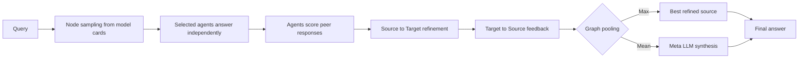

# Graph-of-Agents：把异构 LLM 协作变成查询自适应图

## 1. 论文元信息

- 标题：Graph-of-Agents: A Graph-based Framework for Multi-Agent LLM Collaboration
- 作者：Sukwon Yun、Jie Peng、Pingzhi Li、Wendong Fan、Jie Chen、James Zou、Guohao Li、Tianlong Chen
- 发表：ICLR 2026
- 论文：[arXiv:2604.17148](https://arxiv.org/abs/2604.17148)
- 代码：[UNITES-Lab/GoA](https://github.com/UNITES-Lab/GoA)，MIT License
- 精读依据：16 页论文全文、附录全部 prompts、官方 README 及 `main.py`、`modules.py`、`endpoint.py`

> [!summary] 一句话总结
> GoA 不是训练一个图神经网络，而是在推理时用一个通用 LLM 从模型卡中选择相关模型，让被选模型互评答案形成全局相关性排序，再按照“强者先帮助弱者、弱者改进后反馈强者”的方向进行两轮文本改写，最后选择最佳节点或让 meta-LLM 综合答案。

## 2. 先明确它解决的不是“单模型怎么推理”

当前多智能体方法经常从一个固定工作流出发：预先规定 Planner、Critic、Coder、Reviewer 等角色，然后让所有角色对每个问题都运行。Mixture-of-Agents（MoA）则在每一层调用所有候选模型，把全部回答拼接给下一层聚合器。两种方案都默认“系统中有哪些 agent”已经确定，却没有认真处理模型池不断扩张之后的选择问题。

GoA 面对的是另一类场景：系统拥有通用、代码、数学、生物医学、金融、法律等异构模型。一个题目可能横跨多个领域，但通常不需要所有模型。如果医学问题仍然调用法律和金融模型，不仅浪费成本，错误答案还可能通过多数意见污染最终聚合。

论文因此把问题拆成三个连续决策，原文使用三个很短的提问：**“Which agents?”**、**“How do they communicate?”**、**“How to integrate?”**（第 2–3 页）。对应答案分别是 node sampling、edge sampling/message passing 和 graph pooling。

理解这篇论文的第一条关键判断是：这里的“图”是一种 **LLM orchestration graph**，而不是 GNN。节点是真实的异构语言模型服务；边表示哪个模型的文本回答应该影响哪个模型；message passing 是把邻居回答写进提示词后重新调用模型；pooling 是选择一个文本答案或再次调用 meta-LLM 综合。整个系统没有反向传播、图卷积或可学习邻接矩阵。

## 3. 为什么 MoA 的全量拼接会失效？

设系统有 $N$ 个 agent，每个回答平均长度为 $d$，MoA 有 $L$ 层。论文把其文本整合成本概括为：

$$
C_{MoA}=O(LNd).
$$

人话解释：每增加一个模型，其完整回答都要进入后续聚合上下文；模型池从 6 个增加到 60 个时，调用数、输入 token、噪声和上下文长度同步增加。更重要的是，MoA 对所有回答采用统一的 many-to-one 拼接，无法表达“医学模型应该影响通用模型，但法律模型不应参与”这样的有向关系。

Figure 1 用一个同时涉及血糖动力学、微分方程和神经网络代码的问题说明这一矛盾。理想系统应该选择 biomedical、math 和 code 模型；MoA 却让所有候选模型参与。GoA 的研究假设是：**少量相关 agent 经过结构化沟通，可能优于更多 agent 的无差别混合。**

## 4. 方法全景：从模型池到最终答案

Figure 2 是全文的主图。给定查询 $Q$ 和包含 $N$ 个模型的池，GoA 执行五个阶段：



第一阶段决定调用谁；第二阶段得到初始候选答案；第三阶段评估哪些回答更值得信任；第四和第五阶段沿排序图交换文本；最终 pooling 输出单一答案。它全部运行在 test time，只需兼容 OpenAI completion 格式的模型接口，因此能够混合本地 vLLM 和闭源 API。

## 5. 第一步：Node Sampling 并不是训练好的路由器

每个模型先拥有一张 model card，内容被压缩为领域、任务专长、参数规模和特殊能力。例如 Qwen2.5-Coder 的 card 标记 Coding、code generation、code reasoning、code fixing；Biomedical-Llama 则标记 biomedical QA 和 clinical decision support。

给定查询后，meta-LLM 读取所有 cards，并输出 top-$k$ 个索引：

$$
V_s=\operatorname{MetaLLM}(\operatorname{TopK}\mid Q,\text{Model Cards}).
$$

$V_s$ 是激活节点集合，通常 $k=3$。人话解释：它不是依据实时 benchmark 分数选择模型，而是让通用 LLM 阅读“模型简历”，判断哪几个模型看起来适合当前题目。这使路由完全免训练，但选择质量会受 model card 准确性、prompt 稳定性和 meta-LLM 自身知识限制。

官方代码与论文公式（1）直接对应：

```python
# modules.py:163-190
prompt_content = (
    f"Select {top_k} models best suited for this question.\n\n"
    f"Question: {messages[0]}\n\n"
    f"Available models:\n{json.dumps(model_descriptions)}\n\n"
    "Selection criteria: domain match, task specialization, "
    "include a generalist, then consider model size.\n"
    f"Output exactly {top_k} comma-separated indices."
)
sampled_indices, *_ = generate_vllm(model=model, messages=[prompt_content])
```

代码还有两个比正文更具体的机制。其一，索引允许重复，所以严格来说 $V_s$ 不一定是数学意义上的子集；同一强模型可以作为多个独立节点重复采样。其二，如果初始回答的自报置信度低于 0.1，系统会把该 specialist 替换为 general model。这个 confidence replacement 提高格式鲁棒性，却也意味着最终图不完全由最初 node sampler 决定。

## 6. 第二步：初始回答与 Edge Sampling

被选中的 $S=|V_s|$ 个 agent 首先独立回答问题，得到：

$$
R=\{v_1(Q),v_2(Q),\ldots,v_S(Q)\}.
$$

回答被要求采用 JSON 格式，包含简短 reasoning、answer 和 confidence level。随后每个 agent 排除自己的答案，对其他 $S-1$ 个回答按 correctness、coherence 和 relevance 分配总和为 1 的分数。agent $j$ 从其他评委获得的总相关性为论文公式（2）：

$$
S_j=\sum_{i=1,i\neq j}^{S}\operatorname{Score}_{i\rightarrow j}.
$$

人话解释：每个 agent 同时是答题者和评委。一个回答若被多个其他模型认为正确且相关，它的 $S_j$ 就高。GoA 再把所有 $S_j$ 归一化、排序，并移除低于阈值 $\tau$ 的节点。论文默认 $\tau=0.05$。

论文将边权定义为：

$$
A_{ji}=\frac{S_i}{\sum_{k\in\mathcal N_j}S_k},
$$

其中 $A_{ji}$ 表示 agent $i$ 对 agent $j$ 的影响。直觉上，相关性越高的 source，在目标节点的邻居信息中权重越大。

但源码揭示了一个重要实现事实：GoA 并没有从 pairwise score matrix 中为每一对模型独立决定是否连边。代码先把节点按全局 `final_scores` 排序，然后为每个较高排名节点连接所有较低排名节点：

```python
# modules.py:382-420
ranked_scores_dict = dict(sorted(
    final_scores.items(), key=lambda item: float(item[1]), reverse=True
))
filtered_idx = np.array(scores) > threshold
models = np.array(models)[filtered_idx]

for s_idx in range(len(models) - 1):
    source_node = models[s_idx]
    for target_node in models[s_idx + 1:]:
        edges.append((source_node, target_node))
```

因此，当前实现形成的不是任意稀疏图，而是对保留节点进行全局排序后得到的完整有向无环图：排名高者指向所有排名更低者。$\tau$ 主要剪节点，不是逐边剪枝。这仍然是有效的图式控制流，但“edge sampling”更准确的名称应当是 **peer-scored node ranking + rank-induced edges**。

## 7. 第三步：Source-to-Target 为什么要先强后弱？

设节点已按 $S_j$ 从高到低排列。Source-to-Target 阶段让低排名节点读取所有更高排名节点的回答并重写自己。论文公式（4）可概括为：

$$
R'_j=v_j\!\left(\bigoplus_{i<j}A_{ij}R^{sorted}_i\right),
$$

$\bigoplus$ 表示将邻居回答组织进 prompt。人话解释：较弱 agent 不立即投票，而是先看到较可靠 agent 的推理，用自己的专业能力重新审视和补充。例如 code agent 的初始回答不完整时，可以吸收 math agent 提供的正确公式，再产生可运行代码。

为什么不同时双向讨论？作者认为强节点如果一开始就读取弱节点，容易被噪声拖偏。因此第一阶段只允许高相关信息向下游流动，先提高目标节点质量。

源码并没有对文本向量执行数值乘法 $A_{ij}R_i$。它把归一化权重离散成 high、moderate、low 三档标签，再写进提示词：

```python
# modules.py:428-443
for ref, weight in zip(sources_or_targets, weights):
    if weight > 0.7:
        desc = f"Model {ref} (high relevance):"
    elif weight > 0.4:
        desc = f"Model {ref} (moderate relevance):"
    else:
        desc = f"Model {ref} (low relevance):"
    descriptions.append(f"{desc}\n{initial_responses[ref]}")
```

这说明论文中的 adjacency weight 在工程上是 prompt annotation，而不是精确加权。系统效果依赖 LLM 是否遵循这些文字标签。

## 8. 第四步：Target-to-Source 为什么还要返回？

经过第一阶段后，弱节点已经不再是原始弱回答，而是吸收强节点信息后的改进版本。GoA 再把这些 $R'_j$ 反馈给高排名 source：

$$
R''_i=v_i\!\left(\bigoplus_{j>i}A_{ji}R'_j\right).
$$

人话解释：第一阶段类似专家给助手提供方向；第二阶段让专家检查助手根据该方向完成的具体补充。这样 source 既保持了初始判断优势，又能吸收其他模型在代码细节、领域知识或论证方式上的增量。

Table 5 为这一顺序提供了最有价值的消融证据。完整 GoA 在 MMLU-Pro/GPQA 上为 54.78/39.98；完全反转方向降到 52.18/34.93，是所有消融中损失最大的一项。去掉 Source-to-Target 降到 52.21/36.12；去掉 Target-to-Source 降到 53.66/38.03。由此可见，第一阶段贡献更大，但反馈阶段仍有独立收益。

这里也存在错误放大风险。如果最初排名第一的回答高置信但错误，它会先污染所有目标节点；目标节点再把包含该错误的“共识”反馈给 source，形成回音室。论文 Figure 3 展示的是 GoA 成功排除无关模型的正面案例，但没有系统评估错误 source 或恶意 agent 的传播。

## 9. 第五步：所谓 Graph Pooling 到底是什么？

论文提出两种输出策略：

$$
\mathcal A=
\begin{cases}
R''_{max-source}, & \text{GoA-Max},\\
\operatorname{MetaLLM}(\text{Average}\mid R''), & \text{GoA-Mean}.
\end{cases}
$$

GoA-Max 不再调用聚合器，直接选择相关性最高 source 的 refined response。GoA-Mean 将所有保留节点的 refined responses 交给 meta-LLM，再生成一次综合答案。

因此，“mean pooling”不是把节点 embedding 做算术平均，“max pooling”也不是逐维最大值。它们分别是 LLM synthesis 和 best-node selection。论文借用了图学习术语来描述系统级聚合，但实现仍是纯文本。这个事实解释了两种变体的任务差异：Table 1 中 GoA-Max 在 MMLU、MMLU-Pro、MedMCQA 最好，而 GoA-Mean 在 GPQA、MATH、HumanEval 最好。需要综合多条推理的任务可能受益于额外 meta-LLM；明确选择题则可能因再次生成而引入误差。

## 10. GoA 与 MoA 的关系

MoA 的更新可以写成论文公式（7）：

$$
R'_i=v_i\!\left(\bigoplus_{j=1}^{N}R_j+Q\right).
$$

Proposition 1 指出：当 $k=N$、所有边权为 1、图完全连接、每层加入原始查询的 self-loop，并采用 mean pooling 时，GoA 退化为 MoA。这个命题主要表达框架包含关系：MoA 是“不选择节点、不区分边、不做相关性剪枝”的特殊情况。

从工程角度看，GoA 的真正增量不是“使用了 graph 数据结构”，而是三个决策：基于元数据的路由、基于回答质量的全局排序、基于排序的两阶段改写。图只是把这三个决策放进统一语言。

## 11. 主实验：三名相关 agent 是否真的胜过六名 agent？

模型池包含六个 7B–8B 模型：Qwen2.5-7B-Instruct、Qwen2.5-Coder-7B、Mathstral-7B、Biomedical-Llama3-8B、Finance-Llama3-8B、Saul-7B。评测覆盖 MMLU、MMLU-Pro、GPQA、MATH、HumanEval、MedMCQA，统一使用 zero-shot CoT。

### 11.1 Table 1 的核心结果

| 方法 | Agents | MMLU | MMLU-Pro | GPQA | MATH | HumanEval | MedMCQA |
|---|---:|---:|---:|---:|---:|---:|---:|
| 最佳单模型（各任务可能不同） | 1 | 77.61 | 53.90 | 33.84 | 69.00 | 85.37 | 55.22 |
| MoA | 6 | 75.71 | 53.33 | 32.83 | 65.80 | 76.22 | 54.94 |
| Self-MoA | 6 | 78.14 | 54.19 | 33.84 | 68.20 | 79.27 | 55.56 |
| **GoA-Max** | **3** | **79.18** | **54.78** | 39.98 | 69.83 | 84.67 | **60.04** |
| **GoA-Mean** | **3** | 78.52 | 54.27 | **40.54** | **73.12** | **84.98** | 57.92 |

最强结论并不是 GoA 在每个任务都超过所有单模型。HumanEval 上单独的 Qwen2.5-Coder 为 85.37，高于 GoA-Max 的 84.67 和 GoA-Mean 的 84.98。更可靠的结论是：GoA 在不知道任务最优模型的统一异构池场景中，使用三个节点取得了跨任务更稳健的表现，并显著超过 MoA。

另一个重要观察是 MoA 本身并不稳定：它在 MMLU、MATH、HumanEval 上低于强单模型，支持“加入无关 agent 会引入噪声”的研究动机。GoA 的优势很可能同时来自选择正确 specialist 和通信结构，而不只是图消息传递。

### 11.2 Table 2 的效率结果

| 方法（MMLU-Pro） | Accuracy | LLM Calls | Tokens (k) | Time (s) |
|---|---:|---:|---:|---:|
| MoA | 53.33 | 19 | 56.05 | 240.26 |
| **GoA-Max** | **54.78** | **11** | **19.18** | **100.43** |
| GoA-Mean | 54.27 | 12 | 22.58 | 118.52 |

相对 MoA，GoA-Max 调用减少 42.1%，token 减少 65.8%，墙钟时间减少 58.2%，同时准确率提高 1.45 个百分点。这个结果支持其“少而相关”的路线。

但不能把 top-$k=3$ 简化理解为只调用三个模型一次。GoA 还需要 node selection、每个节点的初始回答、每个节点对其他回答的 judge、两阶段 refinement，Mean 还要最终聚合。虽然 edge judge 的调用数约为 $O(k)$，每次 judge 都读取其余 $k-1$ 个完整回答，因此总体输入 token 仍接近 $O(k^2d)$。它比对全部 $N$ 个模型做 MoA 更省，但并未消除随 $k$ 增长的二次通信负担。

## 12. 扩展与消融怎样支持核心主张？

Table 3 使用 gpt-4o 作为更强模型，GoA-Max 三 agent 在 GPQA、MedMCQA、HumanEval 达到 55.05/82.00/93.29。它优于单 gpt-4o，并在 HumanEval 上超过多数六 agent 基线。不过六 agent GoA-Max 进一步达到 56.57/83.00/93.90，说明“3 个永远优于 6 个”并不成立；准确说法是三 agent 已经非常有竞争力，而更多 agent 在合适编排下仍可能继续提升。

Table 4 固定三个代码模型，排除 node sampling 的影响。GoA-Max 在 HumanEval 得到 85.98，略高于最佳单模型和三 agent MoA 的 85.37。这是证明 message passing 独立有效的重要实验，但增益只有 0.61 pp，且没有方差或显著性检验，因此不能仅凭这一表断言图通信具有普遍大幅优势。

Table 5 显示去掉 edge scoring 后 MMLU-Pro/GPQA 从 54.78/39.98 降至 52.91/37.34，支持 peer relevance weighting。$k=2$ 得到 53.54/36.75，说明模型多样性不足；$k=5$ 为 54.65/39.13，接近但略低于 $k=3$。阈值从 0.05 提高到 0.1、0.2 会持续下降，说明过度剪枝会破坏信息覆盖。

这些消融只覆盖 MMLU-Pro 和 GPQA，且没有报告多随机种子方差。由于 LLM 评委、采样回答和 routing 都具有随机性，未来需要 route stability、置信区间和多次重复，才能确定 $k=3$、$\tau=0.05$ 是稳定规律还是当前模型池的经验点。

## 13. 与刚才的 LatentMAS 有什么根本区别？

| 维度 | Graph-of-Agents | LatentMAS |
|---|---|---|
| 通信介质 | 自然语言文本 | hidden states 与 KV cache |
| 模型关系 | 异构模型池，动态选择 | 主要是兼容表示空间中的多角色模型 |
| 是否训练 | 不训练 | 不训练 |
| 模型访问 | 黑盒 completion API 即可 | 需要 embeddings、hidden states、KV cache |
| 核心优化 | 选择谁、谁影响谁、怎样聚合 | 避免 decode → text → re-encode |
| 可解释性 | 中间回答和评分可读 | latent memory 难以审计 |
| 主要成本 | 多模型调用与长文本互评 | 本地模型前向、cache 与显存 |

因此，如果目标是“免训集成多个不同模型或 API”，GoA 比 LatentMAS 更符合需求。它可以让代码模型、生物医学模型和通用模型通过文本接口协作。代价是它没有消除文本瓶颈，只是通过 top-k 和有向路由减少无关文本。

## 14. 源码复现审计

官方仓库结构清晰：`main.py` 串联 pipeline，`modules.py` 实现四个核心阶段，`endpoint.py` 定义六个 vLLM 服务，数据目录提供 dev/test JSON。README 给出一条 dev 命令，理论上可直接启动。

论文规模复现并不轻量。README 建议每个 7B–8B 模型占用一张 GPU，作者使用 6×A6000。即便算法不训练参数，也必须同时托管六个模型，完整 benchmark 还会产生大量 judge 和 refinement 请求。“Training-free”在这里意味着没有优化步骤，不意味着低硬件成本。

当前仓库没有自动化测试、锁定版本、原始输出日志或生成 Table 1–5 的脚本。更值得注意的是，`main.py` 虽然累计 `input_token_total`、`output_token_total` 和 `total_time`，最终 result 却没有写入这些字段；`edge_sampling` 循环调用多个 judge，但返回的 token 计数仅来自最后一次调用。因而使用当前 commit 可以复现准确率流程，却不能无修改地审计 Table 2 的 token 和时间统计。

代码还有两种 fallback：node sampler 连续解析失败后选择模型列表中的前 $k$ 个；所有节点被阈值剪掉后回退到初始回答的 mean pooling。正式复现应记录 fallback 频率，否则路由失败可能被隐藏在最终平均分中。

一个合理的最小复现是先在 MMLU-Pro dev 子集启动六个 endpoint，固定 `seed=0`、`top_k=3`、`threshold=0.05`、`rounds=1`；额外记录每阶段选择、评分矩阵、fallback、输入输出 token、调用并发和墙钟时间。然后分别关闭 node sampling、edge scoring、S→T、T→S，才能判断收益来源。

## 15. 独立局限与风险

第一，路由依据是静态 model card，而不是模型在当前部署条件下的校准能力。一个标注“数学专用”的模型可能因量化、版本或 prompt 不匹配而退化；meta-LLM 仍会根据简历选择它。更稳健的系统需要在线表现统计或 cost-aware router。

第二，agent 互评不独立。六个模型可能共享训练数据和偏见，错误答案只要表达流畅，就可能获得高 relevance。GoA 把“被其他模型认可”近似为“回答正确”，但二者并不等价。

第三，排序图的结构表达力低于论文名称给人的直觉。当前代码先生成一个全局标量排名，再连接所有高排名到低排名节点；它无法表示 A 擅长检查 B 的代码、B 擅长修正 C 的数学、但 A 与 C 不应直接通信的非传递关系。真正的 pair-specific edge routing 仍未实现。

第四，双向 refinement 可能制造错误共识。强节点先影响弱节点，弱节点的改写又反馈给强节点，使同一错误被多次改述后显得更可信。论文缺少 adversarial agent、confidently wrong source、prompt injection 和恶意 model card 实验。

第五，实验主要是一次性静态问答。没有工具调用、长期 memory、环境反馈、异步 agent 或动态添加/下线模型的测试。GoA 证明了异构模型在 benchmark 推理中的编排价值，还没有证明它能作为复杂自治系统的通用通信层。

## 16. 应该怎样评价这篇论文？

GoA 的优点是问题定义非常实际：当模型池越来越大时，“全部调用”不会自然扩展。方法不要求训练，不依赖模型内部状态，能覆盖开源 vLLM 和闭源 API；Table 2 也同时报告质量、调用、token 和延迟，而不是只展示 accuracy。

它最有说服力的证据是三部分组合：Table 1 表明少量相关 agent 可以胜过全量 MoA；Table 2 表明收益没有用更高成本换取；Table 5 表明方向、反馈和评分都不是完全多余。Figure 3 则提供一个可读案例，展示无关领域模型如何把正确多数聚合带偏。

它最需要降温的地方是“graph”术语。实现没有学习边，也没有执行数值图消息传递或传统 pooling；边来自全局排名，权重被翻译成文本标签，Mean 是 meta-LLM synthesis。更准确的技术描述是：**model-card routing + peer judging + rank-ordered bidirectional refinement**。

## 17. 结论

Graph-of-Agents 提供了一种真正免训练、黑盒友好的多模型集成架构。它的核心价值不是发明一种新的图网络，而是把异构模型选择、回答质量评估、定向反馈和最终聚合组织成查询自适应工作流。对于已有多个垂直模型、希望按题目动态组合能力的系统，这是比固定角色链或全量 MoA 更现实的设计。

但它还不是“任意规模 agent 图”的最终答案。当前 top-$k$ 较小，edge judge 的文本量随 $k$ 近二次增长；图只是由全局排名诱导的 DAG；路由和边都依赖 LLM 自我判断；错误共识、安全与动态环境仍未解决。

> [!quote] 可转述的核心判断
> GoA 的价值不在于让更多模型开会，而在于先决定谁值得参会，再规定谁应当先听谁的。

## 精读补充（PaperForge 视角）

> [!note] 关于这一节
> 用 PaperForge 的读法补几个第一遍没展开的角度：作者是怎么想到"图"这个组织方式的、整篇真正押在哪条假设上、怎么花一周证伪、最强反例、以及一个非增量方向。是接着往深里读，不是打分。论文没明说、属于我推断或猜测的地方都会讲明。

### 作者是怎么走到"图"这个框架的

论文没交代来路，但只用它之前的东西能还原。当时 MoA（Mixture-of-Agents）已经摆在那，毛病也清楚：每层把所有候选模型的完整回答拼给下一层，模型池一大就是成本、噪声和上下文三头涨，而且 many-to-one 的拼接压根表达不了"医学模型该影响通用模型、法律模型不该掺和"这种有向关系。与此同时，垂直专精模型越来越多（Coder、Mathstral、Biomedical、Finance、Saul 各一路），"到底该叫哪几个来"这个选择问题没人正经处理。

把这两件事摆一起，缺的东西自己就浮出来了：一个能"按题选模型、并规定谁影响谁"的结构。而"节点—边—聚合"这套图词汇，正好是描述这种有向选择关系最顺手的语言——尤其对做惯 graph 和 sparse 的人，用图来框"选点、连边、pooling"几乎是条件反射。所以真正的跳跃不是发明了图网络（论文里没有反向传播、没有可学邻接矩阵），而是把一个 orchestration 决策借图的词汇讲清楚。这条路不需要论文自己的结论当前提——不过作者真实动机未必如此。

### 整篇真正押在哪一条假设上

报告第 15 节列了五条独立局限。想再收紧成一条：GoA 全部承重的，是"被其他模型判为相关或正确"约等于"真的正确"这条 peer-score 假设。选点之后的一切——全局排名、由排名诱导的边、以及"强先帮弱、弱再反馈强"的方向——都建立在这个打分能代理正确性上。

危险的地方不是"打分不准就没增益"，而是比这更糟。因为 GoA 拿排名去指挥改写方向：排第一的先污染所有下游，下游把带着这个错误的"共识"再反馈回上游（报告第 8 节那个回音室）。也就是说，一旦一个高置信但错误的回答被排到前面，GoA 不是无所作为，而是会主动放大它。这让它在相关性误差（几个模型因共享训练数据一起错）面前，比 MoA 的平铺平均更脆——MoA 至少不会逼着那个唯一答对的模型先去听错误的多数。报告第 15.2 条点到了互评不独立，这里想强调的是它的后果：GoA 把正确性外包给了模型间的相互认可，而这恰恰是最容易被相关性偏差攻破的信号。

### 花一周就能把这条假设证伪的实验

不用重训、不用扩池，把现有跑批的日志利用起来就行（代码本来就记录了每个回答的评分）。

- 数据：在现有 benchmark 上，给每个回答同时留下两样东西——peer 排名，和对照 ground truth 的真伪。
- 量两件事：一是 peer 排名和真实正确性的相关度（排名到底是不是正确性的好代理）；二是切出"第一名其实是错的"那批题，单独看 GoA 的最终答案，是不是被拖到比最佳单模型还低。
- 判定：如果排名和正确性相关度不高，或者"第一名错"的子集上 GoA 系统性变差，那"peer-score 能撑起整张图"就被证伪了，而且证伪的方式正好是预测中的错误放大，不是随机噪声。

这件事论文其实差一步就能做，它已经有评分和答案，缺的只是把"排名对真伪"单独摊开看。

### 如果要反驳，最强的反例长什么样

最狠的反例是构造一类题：正确答案反直觉，且大多数模型因共享偏见自信地一起错，只有一个 specialist 对。

在这种题上，那个唯一答对的模型不会被 peer 认可，relevance 低，于是被排到 DAG 底端。按 GoA 的流程，它要先读完所有"高相关"的错误回答，再改写自己——结果很可能被带着往错误共识靠。最终 pooling 要么选了高排名的错答案（Max），要么让 meta-LLM 综合一堆错的（Mean）。这里 GoA 不只是没帮上忙，而是比"直接用那个对的单模型"更差，甚至比 MoA 更差，因为它的结构主动让对的去迁就错的多数。

杀伤力在于：这不是某道题偶然翻车，而是方法的核心机制（用同池模型的相互评价来定方向）在相关性错误面前会稳定失灵，而 GoA 越"结构化"、越信任排名，翻得越彻底。图的干净解决不了这个，因为问题出在给边定向的那个信号本身。

### 顺着缺口，一个值得做的新方向

顺着上面——排名信号来自模型池内部的相互认可，天然逃不出共享偏见——一个不增量的方向是：把定边方向的信号从"模型互评"换成"可验证的外部信号"。

- 它针对的缺口：报告第 15 节想要 online 表现统计、cost-aware router、pair-specific 边，但那些还是在"内部信号"里打转。真正的病根是：谁听谁，是由池内共识决定的。
- 能借的相邻领域：test-time verification、process reward model、工具落地的评估。凡是有廉价 verifier 的任务，就用 verifier 打分来定排名和方向——代码用单元测试，数学用符号检查或数值代入，事实题用检索核对——让"谁值得被听"锚在模型池之外的东西上，回音室自然就断了。
- 第一个实验：挑 HumanEval、MATH 这种自带廉价 verifier 的任务，把 GoA 的 peer-score 换成 verifier-score 来定边方向，专门看它能不能把上一节那种"错误放大"的案例压下去，同时保住 Table 2 那样的效率优势。做成了，这张图就从"靠模型互相点头"变成"靠外部真值定向"。

和已有工作划界：这不是再调 k 或 τ（那是同一信号里挪参数），也不是换个更强的 meta-LLM（还是内部判断）；它换掉的是给整张图定向的信号来源。风险也得说：不是所有任务都有廉价 verifier，选择题这类只能退回弱信号或混合信号，这个边界得划清楚。
