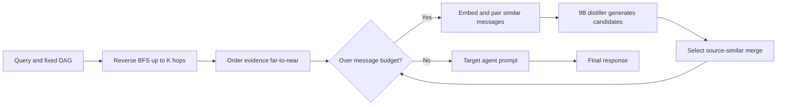

# MOC: Multi-Order Communication in LLM-based Multi-Agent Systems

> [!summary] 一句话结论
> MOC 不训练新的 Agent 或通信策略，而是在既有 DAG 多智能体系统上扩大消息的“证据感受野”：目标 Agent 直接读取最多 $K$ 跳上游的原始回答，再用 embedding 检出近义消息、让一个较小 LLM 压缩合并。它在六个推理/数学/代码 benchmark 上通常小幅提升准确率，但“目标 Agent 输入 token 降低”并不等于“系统总成本降低”；合并阶段额外调用 9B 模型五次生成候选，论文的成本结论需要谨慎解读。

## 论文信息

- 作者：Yao Guan, Lin Wang, Zhihu Lu, Ziyi Wang, Wenzhu Yan, Qiang Duan
- 时间：2026 年 6 月；ICML 2026 regular paper / arXiv:2606.02359
- 原文：https://arxiv.org/abs/2606.02359
- 官方代码：https://github.com/yao-guan/MOC
- 代码核对版本：`9c67c92507570704a7df73e452552a3f49e83897`（2026-06-06）
- 代码状态：已公开，可运行 Gemma/Qwen 的 Ollama 后端及 DeepSeek API 后端；仓库没有随附实验结果快照或明确 LICENSE 文件。

## 研究问题

在拓扑固定的 LLM 多智能体系统中，直接邻居消息拼接只让目标 Agent 看到一阶信息：更远处 Agent 的证据必须经过中间 Agent 转述，可能逐跳遗漏或扭曲。如果简单地把所有上游原始回答都塞进 prompt，证据覆盖扩大了，token、延迟和无关信息也随之增加。MOC 要回答的是：**能否在不训练模型、不改变通信拓扑的条件下，同时扩大多跳证据覆盖并控制目标 Agent 的上下文长度？**

论文第一句关键判断是：现有研究更多优化“agents are connected”，但同样重要的问题是 **“how should we structure the communication scheme to transmit and optimize messages effectively?”**。这使 MOC 与 G-Designer、AgentPrune 等工作形成正交关系：后者改变图，MOC 改变图上流动的消息及其组织方式。

## 1. 把系统看成有序文本消息图

论文把多智能体系统表示成有向图 $G=(V,E)$。节点 $v_i$ 是一个 LLM Agent，其内部状态只抽象为角色和工具：

$$
\theta_i=(\mathrm{Role}_i,\mathrm{Plugins}_i).
$$

人话解释：MOC 不关心模型是否微调过，也不学习 Agent 参数；它把 Agent 当成可接收 prompt、产生自然语言回答的黑盒。边 $e_{i\to j}$ 只表示信息能否从 $i$ 流到 $j$。

目标节点 $v_j$ 的直接前驱集合为：

$$
\mathcal N_j^{\mathrm{in}}=\{v_i\in V\mid A_{ij}=1\}.
$$

传统方案按拓扑执行顺序把这些直接前驱的回答拼成上下文：

$$
C_j=\Psi\!\left(\{R_i\}_{v_i\in\mathcal N_j^{\mathrm{in}}}\mid\pi_j\right)
=\bigoplus_{k=1}^{n_j}R_{\pi_j(k)}.
$$

人话解释：这里没有 GNN 式求和或平均，$\Psi$ 是有顺序的字符串拼接；消息在 prompt 中出现的位置会影响自回归模型的注意力和答案，因此顺序本身就是协议的一部分。

最终回答是：

$$
R_j=f_j(P_{\mathrm{sys},j}\oplus Q\oplus C_j).
$$

其中 $P_{\mathrm{sys},j}$ 是角色/工具提示，$Q$ 是用户问题，$C_j$ 是上游通信。公式揭示了论文的适用边界：它只研究一次 intra-round、按 DAG 拓扑序执行的文本通信，不处理有环对话、异步并发、跨轮记忆或环境动作反馈。

Figure 2（第 4 页）把完整系统画成三层：材料层提供 query、角色和工具；拓扑层给出随机或预定义 DAG；通信层先收集 $K$ 阶消息，再进行 Semantic-Topological Merging（STM）。这张图比摘要更准确，因为它显示 MOC 不是一个新 Agent 框架，而是可以插入现有图执行器的中间件。



## 2. 第一个创新：多阶证据流

### 2.1 为什么直接邻居不够

假设链为 $v_1\to v_2\to v_3$。Vanilla MAS 执行 $v_3$ 时只看到 $R_2$，而 $R_1$ 是否保留，完全取决于 $v_2$ 是否在自己的回答里复述它。连续摘要会造成 semantic attenuation；一条正确但与中间 Agent 判断冲突的证据尤其容易消失。

MOC 直接追溯祖先节点。对任意上游 $v_i$，其到 $v_j$ 的最短可达阶数定义为：

$$
k_{\min}(i,j)=\min\{k\in[1,K]\mid[A^k]_{ij}>0\}.
$$

人话解释：$A^k$ 判断图中是否存在长度为 $k$ 的路径；每条上游消息只按最短路径归入一个 hop，避免同一消息在多个阶重复出现。

第 $k$ 阶回答集合为：

$$
S_j^{(k)}=\{R_i\mid k_{\min}(i,j)=k\}.
$$

所有集合互不相交。论文在每个 hop 内按全局拓扑序排列，并采用“远到近”的线性化：

$$
\mathcal M_j=\bigcup_{k=1}^{K}S_j^{(k)},\qquad
\Pi_j=\pi_j^{(K)}\Vert\pi_j^{(K-1)}\Vert\cdots\Vert\pi_j^{(1)}.
$$

这意味着目标 Agent 先读远端原始证据，再读更接近自己的综合意见。Figure 1（第 1 页）的静脉留置针例子说明动机：直接 Critic 给出 48–72 小时，二跳专家和心理学家给出 72–96 小时；只读一跳会丢掉较可靠的远端答案，多阶流让最终节点能回看来源。

### 2.2 源码对应

官方实现用逆向 BFS 收集最短 hop，`visited` 保证节点只进入第一次发现的层，对应式 (6)–(7)：

```python
# src/graph/graph.py:407
current_level = [target_node]
visited = {target_node}
for hop in range(1, max_hops + 1):
    next_level = []
    for node in current_level:
        for predecessor in node.spatial_predecessors:
            if predecessor not in visited:
                next_level.append(predecessor)
                visited.add(predecessor)
    neighbors_by_hop[hop] = next_level
    current_level = next_level
```

随后 `get_neighbor_summary_with_ism` 以 hop 降序遍历，落实式 (9) 的 far-to-near 顺序（`src/graph/graph.py:722-770`）。这两处证明论文的核心机制确实进入公开代码，而不是只有论文伪代码。

## 3. 第二个创新：Semantic-Topological Merging

多阶消息把证据覆盖问题变成上下文膨胀问题。MOC 引入 $\Phi$，将原始消息和次序压缩为 $(\mathcal M_{j,*},\Pi_{j,*})$：

$$
(\mathcal M_{j,*},\Pi_{j,*})=\Phi(\mathcal M_j,\Pi_j).
$$

完整 Agent 调用可写成：

$$
R_j=f_j\!\left(P_{\mathrm{sys},j}\oplus Q\oplus
(\Psi\circ\Phi)(\mathcal M_j\mid\Pi_j)\right).
$$

当 $K=1$ 且 $\Phi$ 是恒等映射时，MOC 退化为 Vanilla MAS，因此它是通信层的严格扩展。

STM 的处理过程如下。

1. 用 all-MiniLM-L6-v2 把每条消息编码为 384 维向量 $h_i=T(R_i)$。
2. 计算两两余弦相似度 $S_{uv}=\cos(h_u,h_v)$。
3. 取满足 $S_{uv}\ge S_{\max}-\epsilon$ 的高相似消息对，并在一轮中选最大不相交集合。
4. 对每一对消息调用 Gemma-2-9B，按五种提示分别生成候选压缩文本。
5. 选出与两条原消息 embedding 相似度之和最大的候选：

$$
R_v^*=\arg\max_{\hat r\in\mathcal C_v}
\sum_{x\in\{u,v\}}\cos(T(\hat r),h_x).
$$

6. 删除较早消息 $u$，把合并结果放在较晚消息 $v$ 的位置，重复直到消息数满足预算。

论文将消息数量预算写成：

$$
B_{\mathrm{msg}}=\left\lceil\frac{|\mathcal M_j|}{K}\right\rceil+\gamma K.
$$

直观上，$K$ 越大，原始消息越多，但预算不会线性增长；$\gamma K$ 给远端证据留出容忍量。默认实验使用 $K=2$、$\gamma=1$、$\kappa=0.45$、5 个候选。

### 3.1 源码暴露出的真实实现

五种候选不是同一次调用里的五个采样，而是顺序调用本地 `gemma2:9b` 五次：

```python
# src/graph/graph.py:536-553
outputs = []
for i, prompt in enumerate(prompts):
    response = await client.chat(
        model="gemma2:9b",
        messages=[{'role': 'user', 'content': prompt}],
        stream=False,
        options={'temperature': 0.1},
    )
    outputs.append(response['message']['content'].strip())
```

然后代码对五个输出分别计算与两条源消息的 embedding 相似度之和，保留最大者（`src/graph/graph.py:555-581`）。批量不相交配对和“较晚位置作为锚点”也有实现（`src/graph/graph.py:640-710`）。

但论文与代码有一个重要落差：论文声称施加硬约束
$\mathrm{Token}(R_v^*)\le\kappa(\mathrm{Token}(R_u)+\mathrm{Token}(R_v))$，公开代码只是把“Target length: 45%”写入自然语言提示，没有计算输出 token、拒绝超长候选或截断。因此，这是软提示而非可验证的 hard length constraint。另一个复现差异是正文实验写 $\epsilon=0.1$，CLI 默认值却是 `0.01`（`experiments/run_experiment.py:122-126`）。

## 4. 实验结果：有效，但增益通常只有几个样本

实验使用 7 个 Agent、单轮推理，覆盖 MMLU、MMLU-Pro、GSM8K、SVAMP、AQuA 和 HumanEval。Gemma-2-27B 与 Qwen2.5-32B 通过 Ollama 在 RTX 4090 上推理，temperature=0；DeepSeek-V3.2 API 实验 temperature=1。Figure 5（第 16 页）展示了不同边密度的随机 DAG，所有图都先加入一条链保证无孤立节点。

### 表 1：Gemma-2-27B，7 Agent 的平均表现

| 边密度 | Vanilla MAS 平均 | +MOC 平均 | 相对提升 |
|---:|---:|---:|---:|
| 0.3 | 0.7732 | 0.7910 | 2.30% |
| 0.5 | 0.7794 | 0.7897 | 1.32% |
| 0.7 | 0.7727 | 0.7796 | 0.89% |
| 1.0 | 0.7734 | 0.7825 | 1.18% |

Table 1（第 7 页）支持两个结论。第一，MOC 在稀疏图上收益最大，因为直接邻居最少，多跳原始消息补充的信息最多。第二，它并非逐任务稳定提升：全连接图上的 SVAMP 从 0.9200 降到 0.9167，GSM8K 不变。最醒目的 AQuA 6.77% 相对提升是 254 道题上从 0.6969 到 0.7441，约多答对 12 题；多数 0.4%–2% 的变化只对应几道题。

### 表 2：更强模型与不同通信阶数

| 设置 | Vanilla | MOC | 变化 |
|---|---:|---:|---:|
| Qwen2.5-32B, MMLU, $\rho=0.7$ | 0.8211 | 0.8526 | +3.84% relative |
| Qwen2.5-32B, HumanEval, $\rho=0.3$ | 0.8293 | 0.8598 | +3.68% relative |
| DeepSeek-V3.2, MMLU | 0.9228 | 0.9263 | +0.38% relative |
| DeepSeek-V3.2, MMLU-Pro | 0.8821 | 0.8893 | +0.82% relative |

Figure 3(a)（第 8 页）显示 $K=2$ 通常优于 $K=1$，但 $K=3$ 不稳定：HumanEval 在 $\rho=0.5$ 达到 0.8598，在 $\rho=0.7$ 却降至 0.8354。论文据此把 $K=2$ 当作稳健默认值。这个结果也否定了“证据越多越好”：更多祖先消息会引入重复、错误和注意力稀释。

Figure 4（第 8 页）把 MOC 插到 G-Designer 生成的任务自适应拓扑上，在 MMLU、SVAMP、HumanEval 分别提升约 1.8%、1.0%、4.8%，说明通信方案与拓扑设计可以组合。但目标 MAS 输入 token 分别增长 14.1%、11.1%、40.1%，而且这些数字明确排除了压缩模型成本；HumanEval 的收益以明显上下文膨胀为代价。

## 5. 成本审计：局部 token 经济，不等于端到端经济

Figure 3(b) 显示在 20 Agent 时，STM 把目标 Agent 输入从 $13.69\times10^5$ 降至 $12.49\times10^5$，甚至低于 Vanilla MAS 的 $13.38\times10^5$。如果部署瓶颈是最终强模型的 context window，这确实有价值：可以用便宜的 9B 模型先压缩，再减少昂贵目标模型的输入。

但是 Table 3 报告每个 MMLU 样本的合并额外耗时约 80–83 秒，其中 99% 以上来自五候选蒸馏。Table 6（第 17 页）进一步分开了 Agent Tokens 与 Compressed Tokens：

| HumanEval 设置 | Agent tokens | 压缩 tokens | 两者合计 |
|---|---:|---:|---:|
| $\rho=0.5,K=2$ | 797,192 | 336,087 | 1,133,279 |
| $\rho=0.5,K=3$ | 812,513 | 870,624 | 1,683,137 |
| $\rho=0.7,K=2$ | 805,705 | 836,716 | 1,642,421 |
| $\rho=0.7,K=3$ | 825,886 | 865,829 | 1,691,715 |

所以作者的 **“reduces communication costs”** 应限定为：在部分图和规模下，MOC 能减少目标 Agent 接收的消息数或输入 token。若按整个系统的模型调用 token、GPU 时间、能耗或美元成本计算，MOC 未证明更便宜；在 Table 6 的多数组合中，压缩阶段本身就增加 33 万到 87 万 token。

这种代价并不必然让方法失去实用性。如果目标 Agent 是昂贵闭源模型，而压缩器是本地闲置的小模型，把 token 从昂贵端转移到便宜端可能仍然划算。但论文没有报告价格加权成本、端到端 wall-clock、并发调度或不同蒸馏器的质量/成本曲线，因此不能从现有证据得出普遍的成本优势。

## 6. 证据强度与实验缺口

MOC 的实验覆盖三个模型尺度、六类 benchmark、随机 DAG 与 G-Designer 图，外部效度比只测一个数学集更好。公开代码也包含数据子集、图生成、Agent 提示、合并器和 runner，方法透明度较高。

但结果没有置信区间、显著性检验或多随机种子汇总。Gemma/Qwen 虽设 temperature=0，Agent 拓扑固定为一个 seed，模型服务和代码执行仍可能有非确定性；DeepSeek temperature=1 更需要重复实验。MMLU 只抽每类 5 题、MMLU-Pro 每类 20 题，总样本约 280，许多不足 1% 的提升仅相当于 1–3 个样本，不能排除抽样波动。

消融也没有完全拆开两个贡献。Figure 3(b) 只比较 token；准确率表比较 Vanilla 与完整 MOC，却缺少一致覆盖的“仅多阶、不压缩”“仅压缩一阶”“随机合并”“单候选合并”等准确率对照。因此我们知道组合方案有效，却不能严格判断性能来自看见远端原文，还是来自额外 9B 模型进行五次总结和选择。

此外，候选选择指标仍是同一个 MiniLM embedding 的余弦相似度。高相似度衡量语义表面覆盖，不保证数字、否定词、代码边界条件或证据来源被忠实保留。Figure 6（第 16 页）的群论案例合并得很好，但只有一个成功案例，没有事实保持率或 adversarial compression 测试。

## 7. 放回《Five Ws》框架

| Five Ws | MOC 的回答 | 没有解决的部分 |
|---|---|---|
| Who/Whom | 固定 DAG 中所有 $K$ 跳祖先都可向目标节点提供证据 | 不选择可信发送者；恶意或低质量祖先同样进入候选集 |
| When | 单轮内严格按拓扑序执行，前驱完成后目标节点调用 | 不支持异步、循环辩论、事件触发或自适应停止 |
| What | 原始上游自然语言回答；相似消息压缩成合并文本 | 不验证事实、来源、数值与行动承诺是否保持 |
| Why | 减少逐跳语义衰减，让目标节点能核对远端原始证据 | 没有按任务不确定性判断何时确实需要远端证据 |
| How | $K$ 阶 far-to-near prompt + embedding 相似度 + 小模型蒸馏 | $K$、预算、阈值、蒸馏器仍靠人工固定 |

与 Five Ws 综述中“why 应决定其他设计项”的观点相比，MOC 的顺序更接近先固定 how，再验证 benchmark 收益。它适合证据密集、错误会逐跳放大的 DAG 工作流；不适合低延迟控制、强对抗环境或消息必须精确可验证的系统。

## 8. 无需训练的落地方案

MOC 的“training-free”成立：无需微调主模型、训练 router、学习图或构造监督数据。实际依赖是一个目标 LLM、一个本地 Gemma-2-9B 压缩器、all-MiniLM-L6-v2 embedding、一个 DAG 执行器和足够推理预算。

最小可用实现不必照搬五候选策略，可以按以下顺序落地：

1. 在现有 LangGraph/AutoGen/自研 DAG 中，为每个节点记录原始输出和前驱关系。
2. 对高风险汇总节点逆向 BFS，先只启用 $K=2$。
3. 以 hop 从远到近、hop 内按拓扑序组装消息，并保留 Agent ID 与来源。
4. 只有当消息数或 token 超预算时才计算 embedding 并合并；否则直接传递，避免无谓 9B 调用。
5. 将五候选降为一到两个候选，并加入程序化 token 上限、数字/引用保真检查和失败回退。
6. 同时记录目标模型 token、压缩模型 token、端到端延迟、正确率和每题成本，不能只看目标 prompt。

优先应用场景是论文研究 Agent、代码审查链、情报汇总和多专家诊断：这些任务允许秒级到分钟级延迟，且远端原始证据比自然对话流畅度更重要。对于 PR 审查，可以让静态分析、测试、架构、安全 Agent 先独立产出证据，最终 reviewer 读取二跳原文；只对高度相似的诊断合并，并保留文件/行号来源。

## 局限与风险

- 作者明确承认 $K$ 固定且不自适应；$K=3$ 已出现性能回落，未来需要按任务难度、图密度和消息可靠性动态决定感受野。
- 多跳传播扩大了攻击面。被攻陷的远端 Agent 可以绕过中间节点过滤，直接把 prompt injection 或错误证据送达目标节点。
- 论文的硬长度约束没有在公开实现中程序化执行，只由提示词要求 45%；模型不遵守时不会被拒绝或重试。
- 正文使用 $\epsilon=0.1$，CLI 默认 `0.01`；压缩模型与 embedding 路径也硬编码，README 没有给出复现实验表格的完整命令矩阵。
- “通信成本降低”未包括所有蒸馏 token 和延迟。每次合并生成五个候选，是准确率/压缩质量与成本之间最重的隐藏变量。
- 缺少多 seed、误差条和统计检验；小数据子集上的多数微小提升证据较弱。
- 缺少信息保真评测和恶意消息实验；embedding 相似不等于事实、数值、逻辑或代码语义保持。
- 方法限定于单轮 DAG；真实多智能体应用常包含环、重试、工具反馈和跨轮记忆，直接推广尚未验证。
- 官方仓库依赖大量精确版本和本地 Ollama 模型路径，没有容器、锁定硬件配置、结果 artifact 或明确开源许可证，完整复现仍有摩擦。

## 结论

MOC 的核心贡献不是“更多 Agent”，而是把通信拓扑和消息可见范围分开：即使边不变，目标节点也可以看到多跳原始证据。这是对传统一阶拼接的清晰修正，而且可以作为推理期中间件接入现有 DAG，无需训练任何模型。

论文最值得保留的工程原则是：**远端证据要可追溯，重复证据要在进入昂贵模型前压缩。** 最需要修正的工程结论则是：压缩不能只优化目标 prompt；必须把压缩器自身的 token、延迟、保真度和攻击面一起计入系统预算。MOC 因而更像一个有希望但尚未完成成本闭环的通信原语，而不是已经证明普遍经济的生产方案。

## 关键概念

- Multi-Order Communication
- Evidence Receptive Field
- Semantic Attenuation
- Topological Message Ordering
- Semantic-Topological Merging
- Structural Message Consolidation
- Inference-time Multi-Agent Collaboration
- Training-free Communication Middleware

## 开放问题

- 能否用目标节点的不确定性或 verifier 信号动态选择 $K$，而不是所有任务固定读取二跳？
- 如何把来源可信度、Agent 历史正确率和攻击检测加入相似度之外的合并决策？
- 是否能用抽取式压缩、结构化 schema 或 lossless provenance 替代五次生成式蒸馏？
- 在相同总 token、总延迟和美元预算下，MOC 是否仍优于增加一次 self-reflection、best-of-N 或简单 ensemble？
- 对数字、代码、引用和否定关系，应使用什么可验证的 message-fidelity 指标？
- 有环、异步和跨轮多智能体系统中的“阶数”应该如何定义与缓存？

## 证据定位

- Figure 1（第 1 页）：一阶通信遗漏远端正确证据的动机案例。
- Figure 2 与式 (6)–(9)（第 4 页）：多阶消息流、far-to-near 排序和整体架构。
- 式 (10)–(16)、Algorithm 1（第 5–6 页）：STM、候选选择、消息预算与批量合并。
- Tables 1–2（第 7 页）：Gemma/Qwen 六 benchmark 主结果。
- Figure 3、Table 3、Figure 4（第 8 页）：$K$ 消融、输入 token、约 80 秒压缩延迟和 G-Designer 泛化。
- Table 4 与 Limitations（第 9 页）：DeepSeek 扩展实验及作者自述局限。
- Figure 6（第 16 页）：语义相似消息合并案例。
- Table 6（第 17 页）：Agent tokens 与压缩器 tokens 的分项成本。
