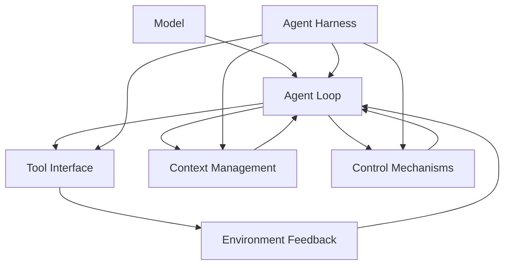

# 什么是 Agent Harness？

> **一句话定义：**Agent harness 是包围模型的运行时控制层：它通过循环、工具接口、上下文管理和控制机制，把一次模型调用变成能够观察、行动、验证、恢复并受约束地完成任务的 agent 系统。

## 主题界定

Agent harness 至少有两种讨论尺度，不能混为同一个定义。

第一种是**构成性定义**：判断某个运行时系统“是不是” harness。本文采用 arXiv:2606.10106 提出的四项纳入测试作为清晰的操作性边界：系统必须同时具有推理—行动—观察循环、可改变外部环境的工具接口、主动上下文管理，以及不依赖模型配合也能生效的控制机制（来源观点；定位：第 4 节，官方 PDF 页 6–8〔印刷页 5–7〕的框定定义与表 2，以及页 8〔印刷页 7〕表 2 后的纳入/排除测试段落）。这是该预印本提出的参考定义，不代表已经形成经验上验证过的行业共识。

第二种是**工程实践**：判断 harness 如何变得可用、可靠、可维护。OpenAI、LangChain 与 Fowler 的文章分别把范围扩展到仓库知识、执行环境、文件与 Git、反馈传感器、架构约束和熵管理。这些组件可以增强四项核心功能，但不应被误写为额外的必要条件（综合判断；依据见后文六个来源的小节）。

本文因此先回答“什么条件下它成立”，再回答“成立之后怎样把它工程化”。

## Harness、Model、Agent 与 Framework

- **Model** 是推理引擎：它接收当前输入，生成自然语言输出或工具调用意图。单次推理本身不会自动拥有持续任务状态、执行权限或确定性验证。
- **Agent** 是会根据观察选择后续行动的系统。Anthropic 将预定代码路径称为 workflow，将由 LLM 动态决定过程和工具使用的系统称为 agent（来源观点；[定位：全文 H2 #1（工作流与智能体的定义边界），第 1 个列表]）。
- **Harness** 是运行时控制层：它承接模型的行动请求，执行工具，把结果作为新观察送回循环，并管理上下文与非模型控制。Codex 的运行 walkthrough 明确展示了“推理—工具执行—结果写回—再次推理”的闭环（来源观点；[定位：全文 H2 #1（智能体循环），第 2、5 段]）。
- **Framework** 是复用这些能力的构建工具箱，可能提供模型适配、工具注册、编排、状态或中间件。是否形成完整 harness，仍要看具体实例在任务运行时是否满足四项构成判据；“使用了 agent framework”不能替代逐项检查（综合判断；四项门槛依据：arXiv:2606.10106 第 4 节，官方 PDF 页 8〔印刷页 7〕表 2 后的纳入/排除测试段落）。

四者的关系可以简写为：模型负责提出下一步，agent 体现基于观察而改变行动的能力，harness 让这种能力在环境中持续而受控地运行，framework 则帮助工程师搭建这些部件。一个 framework 可以只提供其中一部分；一个 harness 也可以由项目自有代码、脚本和仓库约定组成。

## 四项构成判据

以下判据的“构成性”与阈值均来自 arXiv:2606.10106，而不是本文自行宣称的行业标准（来源观点；定位：第 4 节，官方 PDF 页 6–8〔印刷页 5–7〕的框定定义与表 2，以及页 8〔印刷页 7〕表 2 后的纳入/排除测试段落）。四项必须同时成立：

1. **Agent Loop（推理—行动—观察循环）**：模型根据当前状态决定行动，行动结果作为观察进入下一轮推理。只有一次问答或一次固定调用，不构成这个闭环。
2. **Tool Interface（工具接口）**：接口不仅能读取信息，还必须能改变外部环境。只读检索可以为模型补充知识，却未达到该论文对 T2 的阈值。
3. **Context Management（主动上下文管理）**：运行时应根据内容或任务选择、组织、保留或压缩上下文；仅按长度机械截断不达到该论文对 T3 的阈值。
4. **Control Mechanisms（模型无关控制机制）**：至少一种限制、验证或确定性动作即使模型不合作仍然有效，例如权限边界、步数限制或测试门禁。

这四项回答的是成员资格，不是成熟度排名。多 agent、学习或微调、某个特定模型和用户界面都不是必要条件（来源观点；定位：arXiv:2606.10106 第 4 节，官方 PDF 页 7〔印刷页 6〕的非必要属性段落）。同理，日志、重试、规划文件和沙箱往往很有价值，但应先说明它们增强哪一项核心功能，而不是无限扩张定义。

## 从构成到工程：上下文、约束与熵管理

OpenAI 的实践把工程师角色描述为设计系统、脚手架、工具、抽象与反馈回路，并建议让短小的 `AGENTS.md` 充当结构化、版本化仓库知识的地图（来源观点；[定位：全文 H2 #2（工程师角色重定义），第 1—4 段；全文 H2 #4（仓库知识系统），第 1—4、7 段]）。同一文章还以自定义 linter 和结构测试机械执行架构不变量，并用周期性清理与“黄金原则”抵抗 agent 复制既有模式造成的漂移（来源观点；[定位：全文 H2 #6（架构约束），第 1—5 段；全文 H2 #10（熵与清理），第 1—5 段]）。

Fowler 则把 coding-agent 用户的外层 harness 写成互补的 feedforward guides 与 feedback sensors：前者在行动前引导，后者在行动后提供可自我纠正的信号（来源观点；[定位：全文 H2 #3（前馈与反馈），第 1 个列表与第 2 段]）。这些控制既可以是计算式的，也可以是推断式的，具体例子包括脚本、codemod、结构测试、静态分析、`AGENTS.md`、skills 与 review agents（来源观点；[定位：全文 H2 #4（计算式与推断式控制），表格]）。

**综合判断：**可以把成熟 harness 理解为三个相互连接、但层级不同的工程回路：上下文工程让模型在当前任务中看到正确的信息；机械约束与可执行反馈限制当次行为并暴露错误；熵管理把重复出现的失败模式反写为规则、测试或清理任务，防止长期漂移。它们分别服务于认知可行性、运行时可控性和系统可维护性，不应都缩减为“写更长的 prompt”。这一组合是对 OpenAI 与 Fowler 实践框架的综合，而非任何单一来源给出的必要且充分定义。

## 概念地图

图中的闭环有直接的运行时依据：Codex walkthrough 描述工具结果被追加到下一次模型输入，循环直到模型输出 assistant message（来源观点；[定位：全文 H2 #1（智能体循环），第 6—7 段]）。四条从 Harness 指向核心部件的边，则采用 arXiv:2606.10106 的四项构成性拆分（来源观点；定位同前：第 4 节，官方 PDF 页 6–8〔印刷页 5–7〕表 2）。

## 最小对比案例：给 Python CLI 增加输入校验

这是一个**有来源支撑的执行路径分析**，不是模型对照实验；本文没有运行两个模型、没有报告性能数字，也不声称该路径必然提升正确率。场景假设是：给已有 Python CLI 增加参数校验，同时遵守仓库规则与测试门禁。

### 裸模型调用

用户把需求和少量代码片段一次性发给模型，模型返回建议补丁。没有运行时循环替模型读取仓库、编辑文件、执行测试或把失败结果送回下一轮；也没有独立权限、恢复点或完成门禁。它可以产出有用文本，但按四项测试并不是完整 agent harness（综合判断；判据依据：arXiv:2606.10106 第 4 节，官方 PDF 页 8〔印刷页 7〕表 2 后的纳入/排除测试段落）。

### 带 Harness 的 Agent

执行路径如下，每一步括号中标出主要的 harness 部件：

1. **读取仓库规则与相关文件**（Context Management + Tool Interface）：主动选择 `AGENTS.md`、CLI 入口和相关测试，而不是把整个仓库无差别塞入 prompt。仓库本地知识与渐进披露的依据见 OpenAI [定位：全文 H2 #4（仓库知识系统），第 1—4、7 段]。
2. **建立任务状态**（Context Management）：记录目标、约束、已读文件和待验证事项，让后续迭代能够延续。文件系统承担上下文窗外状态与中间结果的依据见 LangChain [定位：全文 H2 #5（持久存储与上下文管理），第 1 个列表与第 5 段]。
3. **在隔离 worktree 中编辑**（Tool Interface + Context Management）：工具在独立 checkout 中改变真实代码，Git 保存差异并支持比较或恢复。**综合判断：**worktree 是本案例对状态与工具工作流的工程适配，只分离 checkout，不执行文件系统或进程权限；真正的权限边界必须由沙箱或工具策略提供。文件/Git 的持久状态与回滚依据见 LangChain [定位：全文 H2 #5（持久存储与上下文管理），第 5 段]；沙箱隔离依据见 [定位：全文 H2 #7（安全执行与验证），第 3 段]。
4. **运行聚焦测试**（Tool Interface + Control Mechanisms）：测试运行器把可执行验证变成模型外部的确定性传感器。测试工具提供观察并支持自验证的依据见 LangChain [定位：全文 H2 #7（安全执行与验证），第 4—5 段]。
5. **解释失败并迭代**（Agent Loop + Environment Feedback）：把测试输出作为新观察，模型据此选择下一次读取、编辑或测试。工具结果进入下一轮推理的依据见 OpenAI Codex 文章 [定位：全文 H2 #1（智能体循环），第 5—7 段]。
6. **运行完整验证**（Control Mechanisms）：在局部修正后执行更广的门禁，避免模型仅凭自述宣布成功。模型无关验证及其独立生效阈值的依据见 arXiv:2606.10106 第 4 节表 2 与官方 PDF 页 8（印刷页 7）表后段落。
7. **发出可审计结果**（Context Management + Control Mechanisms）：报告改动、命令、结果和仍存疑点，使人能复核完成判据。Fowler 关于反馈传感器与持续改进的依据见 [定位：全文 H2 #3（前馈与反馈），第 1 个列表与第 2 段；全文 H2 #6（迭代维护），第 1 段]。

### 对照表

| 维度 | 裸模型调用 | 带 Harness 的 Agent |
|---|---|---|
| 输入上下文 | 用户一次性提供需求与片段 | 主动读取规则、实现与测试，并按任务选择上下文（Context Management） |
| 迭代 | 通常止于一次回答 | 推理—行动—观察循环持续到满足停止条件（Agent Loop） |
| 工具反馈 | 没有真实执行结果回流 | 文件、测试与命令结果写回下一轮（Tool Interface + Environment Feedback） |
| 状态 | 仅有当前请求中的临时文本 | 任务记录、文件与 Git 保存中间状态（Context Management） |
| 权限 | 没有独立的运行时边界 | 沙箱或工具策略限制文件系统、进程及可调用能力；worktree 不承担权限隔离（Control Mechanisms） |
| 验证 | 依赖模型自述或用户之后检查 | 聚焦测试与完整门禁提供模型外验证（Control Mechanisms） |
| 恢复 | 失败后由用户重新组织上下文 | 从持久状态、版本记录与失败观察继续（Context Management + Agent Loop） |
| 完成判据 | “已经回答”即结束 | 确定性检查通过并输出可审计结果（Control Mechanisms） |

表中“迭代”和“工具反馈”对应 OpenAI Codex 文章 [定位：全文 H2 #1（智能体循环），第 5—7 段]；“状态”和“恢复”对应 LangChain [定位：全文 H2 #5（持久存储与上下文管理），第 1 个列表与第 5 段]；“权限”和“验证”对应其 [定位：全文 H2 #7（安全执行与验证），第 3—5 段] 及 arXiv:2606.10106 的 T4。**综合判断：**差别不在模型是否更聪明，而在执行路径是否把环境观察、状态与独立控制接成一个闭环。

## 六份独立报告导航

1. **定义在工程组织中的落地：**[OpenAI Harness Engineering 来源报告](../openai-harness-engineering/report.html)。它说明工程师怎样设计仓库知识、可观察性、架构约束和持续清理；关键依据见原文全文 H2 #2、#4、#6 与 #10。
2. **运行时循环：**[OpenAI Codex Agent Loop 来源报告](../openai-codex-agent-loop/report.html)。它逐步展示推理、工具执行、观察写回和 compaction；关键依据见原文全文 H2 #1 第 5—10 段及 H2 #2 性能考量末段。
3. **架构边界：**[Anthropic Building Effective Agents 来源报告](../anthropic-building-effective-agents/report.html)。它区分固定 workflow 与动态 agent，并说明环境反馈、停止条件和复杂度权衡；关键依据见原文全文 H2 #1 的定义列表和 H2 #4 Agents 子节。
4. **组件解剖：**[LangChain Agent Harness Anatomy 来源报告](../langchain-agent-harness-anatomy/report.html)。它从期望行为反推文件系统、Git、sandbox、验证和长时任务组件；关键依据见原文全文 H2 #2、#5、#7 与 #10。
5. **工程控制系统：**[Fowler Harness Engineering 来源报告](../fowler-harness-engineering/report.html)。它用 feedforward、feedback、计算式/推断式控制和 steering loop 描述用户外层 harness；关键依据见原文全文 H2 #3、#4、#6 与 #9。
6. **构成性成员测试：**[What Makes a Harness a Harness 论文报告](../what-makes-a-harness-a-harness/report.html)。它提出 T1—T4 并与 framework、SDK、IDE plugin、eval harness 和 orchestrator 分界；关键依据见论文第 4 节表 2、第 5 节和第 6 节表 4。

## 跨来源综合：共识、分歧与互补

### 三组共识

1. **模型本身不是完整 agent。**OpenAI 的运行 walkthrough、Anthropic 的环境反馈循环、LangChain 的模型能力缺口和 arXiv 四项测试都要求模型外存在行动、观察和状态机制。
2. **可靠完成不能只依赖模型自述。**OpenAI 的测试与 lint、Fowler 的 feedback sensors、LangChain 的 verification hooks 以及 arXiv T4 都把外部验证视为可信执行的关键。
3. **长时工作需要外部状态。**OpenAI 的 compaction 与仓库知识、LangChain 的文件/Git、Fowler 的持续传感器共同表明，长期任务不能只靠无限增长的 prompt。

### 两组边界差异

1. **harness 边界宽度不同。**LangChain 倾向把模型之外的全部代码、配置和执行逻辑纳入 harness；arXiv 论文只把 loop、tools、context、control 当作成员条件，其余属于成熟度组件。本文采用后者判断“是不是”，采用前者说明“可以怎样实现”。
2. **讨论尺度不同。**OpenAI Codex 文章描述单次运行内核；OpenAI Harness Engineering 与 Fowler 描述代码库和团队的长期控制系统。两者不是互斥定义，而是运行时核心与工程环境两个尺度。

### 一组互补关系

六个来源可以连成“定义—实现—维护”链：arXiv 给出成员测试，OpenAI Codex 展示循环实现，Anthropic约束何时需要动态 agent，LangChain列出实现部件，OpenAI 工程实践说明怎样把仓库变得可工作，Fowler则说明怎样用重复失败持续改进控制系统。

## 常见误区

1. **Prompt ≠ harness。**系统提示可以作为 feedforward guide，但它本身没有行动—观察循环、可改变环境的工具、主动上下文管理和模型外控制。把 prompt 写长不会自动补齐这些部件（综合判断；四项门槛见 arXiv:2606.10106 第 4 节表 2）。
2. **工具 wrapper ≠ harness。**一次 API 包装即使能调用工具，也可能没有迭代、上下文选择或模型无关门禁；工具必须进入可观察、可纠正的运行时闭环（综合判断；循环依据见 OpenAI Codex 文章 [定位：全文 H2 #1（智能体循环），第 5—7 段]；T1–T4 全纳入测试见 arXiv:2606.10106 第 4 节表 2 后段落）。
3. **Framework ≠ 自动获得完整 harness。**framework 提供可复用原语，但具体配置可能只形成预定 workflow，或者缺少四项中的某一项（综合判断；workflow/agent 边界见 Anthropic [定位：全文 H2 #1（工作流与智能体的定义边界），第 1 个列表]；构成门槛见 arXiv:2606.10106 第 4 节表 2）。
4. **脚手架越多 ≠ 总是越好。**Anthropic 建议在简单方案足够时优先简单方案，并指出自治会增加成本和错误累积风险（来源观点；[定位：全文 H2 #4（构建模式中的智能体），第 23—24 段]）。额外机制应对应已识别的失败模式，并能说明它增强循环、工具、上下文还是控制中的哪一项（综合判断）。

## 实践启发

- 先画执行闭环，再选产品：列出模型何时决策、工具如何改变环境、观察如何回流、何时停止，然后逐项检查 T1–T4。
- 把上下文做成可维护的信息架构：让短规则文件指向相关文档、代码和测试，避免单一巨型提示。该建议来自 OpenAI [定位：全文 H2 #4（仓库知识系统），第 1—4、7 段]。
- 同时设计行动前约束和行动后传感器：规则、类型与接口说明负责 feedforward，测试、lint、日志和审查负责 feedback。该划分来自 Fowler [定位：全文 H2 #3（前馈与反馈），第 1 个列表与第 2 段；全文 H2 #4（计算式与推断式控制），表格]。
- 让关键门禁独立于模型自觉：权限、测试、预算和停止条件若只写在提示中，模型不配合时就无法构成 T4 所要求的控制（来源观点；arXiv:2606.10106 第 4 节，官方 PDF 页 8〔印刷页 7〕表 2 后段落）。
- 把重复失败转化为系统改进：更新规则、结构测试或周期性清理，而不只是修当前输出。该实践依据 OpenAI [定位：全文 H2 #10（熵与清理），第 1—5 段]，以及 Fowler [定位：全文 H2 #6（迭代维护），第 1 段]。

## 开放问题

- arXiv:2606.10106 的四项条件能否在跨框架、跨任务的独立分类中获得稳定一致性？该论文是定义性预印本，本身没有做这种经验验证（来源观点与局限；定位：第 1 节官方 PDF 页 3〔印刷页 2〕的研究定位段）。
- 上下文压缩怎样在节省 token 的同时保留长期任务的因果状态？Codex 的实现采用阈值触发的 compaction，LangChain 还列出工具输出卸载、skills、文件/Git 与规划等组合，但六个来源没有给出统一最优策略（来源观点；OpenAI Codex [定位：全文 H2 #2（模型推理下的性能考量），第 11—14 段]；LangChain [定位：全文 H2 #9（上下文退化管理），第 4—6 段；全文 H2 #10（长时自治执行），第 2—7 段]）。
- 哪些控制必须是计算式，哪些可以交给推断式 reviewer？Fowler 将二者并列，但其行为控制主题小节对 AI 生成测试的可信度保留疑问（来源观点；[定位：全文 H2 #4（计算式与推断式控制），表格；全文 H2 #8（控制类别中的行为控制），第 10—12 段]）。
- 长期自治下，怎样验证架构一致性而不让人类重新逐项检查所有输出？OpenAI 在末尾学习中问题小节保留了长期架构连贯性与人类判断位置的问题（来源观点；[定位：全文 H2 #11（仍在探索的问题），第 2 段]）。

## 刻意未纳入

本报告只使用前述六个固定来源作为证据。阅读列表 Foundations 中剩余的 24 个条目没有进入论证；更专门的 compaction、eval、permissions 等章节也没有作为证据来源。这样做是为了维持预先确定的来源角色与可审计边界，而不是暗示那些材料不重要。本文也没有进行模型实验、benchmark 比较或性能数字汇总。

## 来源清单

1. `url:f6b93302265d` — [原文](https://openai.com/index/harness-engineering/) — [独立报告](../openai-harness-engineering/report.html) — role: `definition`
2. `url:ae10eb4597fe` — [原文](https://openai.com/index/unrolling-the-codex-agent-loop/) — [独立报告](../openai-codex-agent-loop/report.html) — role: `runtime-loop`
3. `url:38c43325a50c` — [原文](https://www.anthropic.com/research/building-effective-agents) — [独立报告](../anthropic-building-effective-agents/report.html) — role: `architecture-boundary`
4. `url:7659f727e260` — [原文](https://blog.langchain.com/the-anatomy-of-an-agent-harness/) — [独立报告](../langchain-agent-harness-anatomy/report.html) — role: `component-anatomy`
5. `url:33f520c0c534` — [原文](https://martinfowler.com/articles/exploring-gen-ai/harness-engineering.html) — [独立报告](../fowler-harness-engineering/report.html) — role: `engineering-system`
6. `arxiv:2606.10106` — [原文](https://arxiv.org/abs/2606.10106) — [独立报告](../what-makes-a-harness-a-harness/report.html) — role: `constitutive-test`

## User notes
