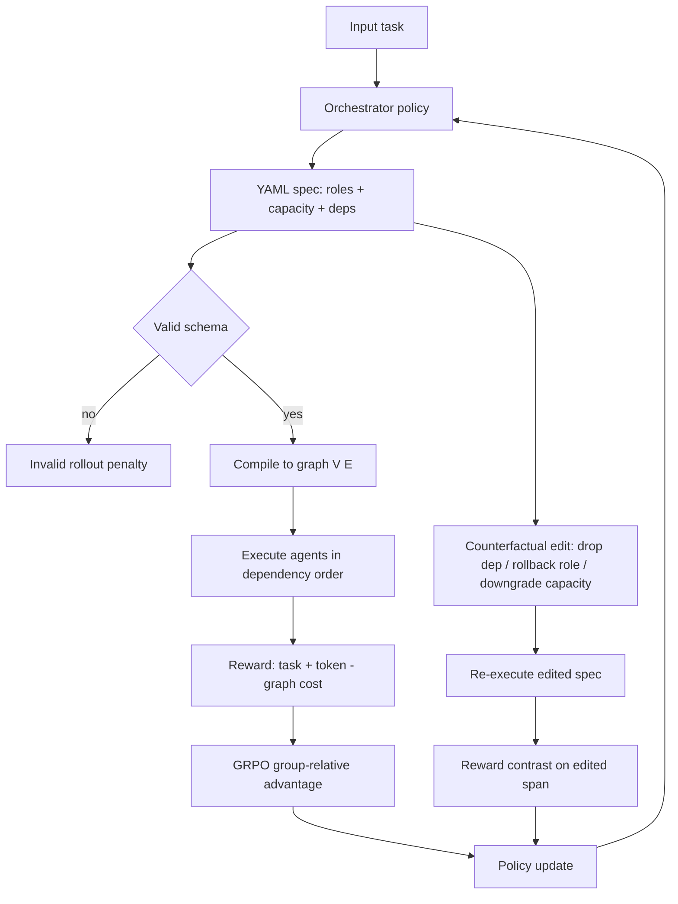

# LEMON: Learning Executable Multi-Agent Orchestration via Counterfactual Reinforcement Learning

> [!summary] 一句话结论
> LEMON 把 LLM 多智能体编排重构为「生成一份可执行规范」——把角色、算力档位、依赖结构一次性写进同一份可编译执行的 YAML；再用局部反事实强化学习，只对被编辑的那个字段（删依赖/退角色/降算力）施加奖励对比，从而把稀疏的整体执行奖励定位到具体决策上。六个推理与代码基准平均 90.72%，在准确率-token 帕累托前沿上取得 SOTA。

## 论文信息

- 作者：Xudong Chen, Yixin Liu, Hua Wei, Kaize Ding
- 年份：2026
- Venue：unknown
- 原文：https://arxiv.org/abs/2605.14483

## 研究问题

如何让 LLM 编排器把「任务专属角色、每个智能体的算力档位、依赖结构」作为单一可执行规范联合生成，并在训练时把信用分配到具体的编排决策（而非只对整份规范的执行结果给稀疏奖励）？

## 核心贡献

- 将多智能体编排形式化为「组合式可执行规范生成」：一份 step 结构的 YAML 规范同时组合任务专属角色（身份 a_v、继承基role b_v、定制职责 d_v）、每个智能体的算力档位 L_v 与依赖引用，经 schema 校验后编译为可执行编排图 G=(V,E)（§1、§3.1）。
- 提出局部反事实信用分配：在 orchestration 级 GRPO 之外，对单个角色/算力/依赖字段做反事实编辑并重执行，仅把奖励对比施加到被编辑的 token 段，将稀疏执行奖励转成字段级监督（§3.4，式10–12）。
- 三类编辑族的自适应采样（删一条依赖 m_E / 把定制职责退回基role m_R / 降一档算力 m_L），带概率下限保探索（§3.4 算法）。
- 在六个推理/代码基准上平均 90.72%、5/6 最优，且位于准确率-token 帕累托前沿（§4.2 Table 1、Fig 3）。

## 方法直观解释

编排策略 π_θ 把输入任务映射为一份 step 结构 YAML：每个 agent 条目声明角色（身份 + 继承基role + 定制职责）、算力档位（用哪个 worker 模型）与对更早 agent 的依赖引用；规范经校验后编译为 DAG G=(V,E)，按依赖序执行，每个 agent 接收任务与父节点输出产出 o_v（式6）。训练分两段：先在 teacher 生成的合法规范上做 SFT 学格式（无此暖启动则早期 RL 多为非法 rollout），再用 GRPO 优化，编排奖励 = 任务成功 + token 效率奖励 − 图结构代价（式8），用组相对优势（式9）。核心是局部反事实信用：对一份合法规范只编辑一个字段（m_E 删依赖 / m_R 把职责退回基role / m_L 降算力），重执行得奖励对比 Δc（式10），并把偏好只施加到被编辑 token 段（式12，按 |Δc| 加权），其余部分作为冻结上下文——从而把信用定位到真正改变结果的那个决策。节点级执行缓存复用未变的 agent 输出，使反事实重执行不至于成本翻倍。

## 实验与证据

- 六基准：GSM8K、MultiArith、SVAMP、AQuA（数学）、MMLU（多选）、HumanEval（代码）；MMLU 用 1,531 条验证集、HumanEval 用 124 条 held-out 划分（§4.1，Table 1 脚注）。
- 14 个基线，覆盖单智能体（Vanilla、CoT、SC-CoT）、固定结构 MAS（Chain/Tree/Complete/Random）、拓扑设计（AgentPrune、AgentDropout、G-Designer、ARG-Designer、OFA-MAS）、自适应工作流（AFlow）（§4.1）。
- 在 MMLU/GSM8K/AQuA 上消融：去 SFT、去全局 RL、去角色/算力/结构生成、去每个反事实编辑族；另有 token 效率帕累托、案例研究、训练动态分析（§4.2，Table 1–2、Fig 3–5）。

## 主要发现

- 平均 90.72% 最优、5/6 基准最优，MMLU 第二（84.32，落后 ARG-Designer 0.98）；相对最强单智能体 SC-CoT +3.96、固定 Tree-MAS +2.19、自适应 AFlow +5.35、拓扑 AgentPrune +2.59（Table 1）。
- 位于准确率-token 帕累托前沿：MMLU 约 0.2×10^4 tokens，对比 ARG-Designer 约 0.3×10^4、部分拓扑基线 >0.6×10^4（Fig 3）。
- 消融：去 SFT 灾难性崩塌到 48.53/75.82/64.96，说明暖启动对稳定 RL 探索关键；局部反事实目标较 Global-RL-only 同时提准降 token（MMLU 83.08→84.32 acc、2543→2148 tokens）；去算力分配使 token 显著上升（3401/4311/4154）；三个编辑族逐一移除都掉点（Table 2）。
- 训练动态：加反事实目标使最终奖励约 2.0→2.25、每次执行 worker token 约 1.30K→1.15K，训练成本约 +12%（7.4M→8.3M tokens，靠节点级缓存未翻倍）；删依赖给出最强的早期奖励对比（Fig 5）。

## 局限与风险

- 【原文无独立局限章节，以下为审读判断】
- 评测局限于数学/多选/代码等短程推理任务，未涉工具使用、开放式、长程、具身或多轮交互场景。
- 反事实训练带来约 12% token 开销并依赖节点级缓存；未报告墙钟/延迟，也未测大规模 agent 数下的扩展性。
- 依赖更强 teacher 模型做 SFT 暖启动，去 SFT 即崩——无强 teacher 时的鲁棒性未验证。
- 匿名预印本（arXiv 2605.14483），未经同行评审；代码为双盲匿名链接。

## 复现条件

- 代码：https://anonymous.4open.science/r/LEMON-B23C（匿名）。
- Appendix A 给出 YAML 规范格式与具体示例；Appendix D.7 完整评测协议；Appendix C 节点级执行缓存细节。
- 基准均为公开数据集（GSM8K/MultiArith/SVAMP/AQuA/MMLU/HumanEval），基线为已发表公开方法。
- 完整复现需 teacher 模型（SFT）与各算力档位的 worker LLM——所读正文未完全指明具体型号。

## 关键概念

- 组合式可执行编排
- 局部反事实信用分配
- 稀疏信用分配
- 可执行编排规范
- 角色-算力-依赖联合设计

## 开放问题

- 局部反事实信用能否泛化到工具使用、长程或交互式多智能体任务，而不止于短程推理/代码？
- 随 agent 数 / 规范长度增长，方法如何扩展，反事实重执行在大规模下的延迟代价几何？
- 三个手工编辑族（删依赖/退角色/降算力）能否学习或扩展（如增删 agent、改聚合），而非固定？
- 性能对 teacher 质量有多敏感，能否在无更强 teacher 时自举出优质规范？

## 证据定位

- §1 与 Figure 1 定义两大挑战（分解式设计；稀疏信用分配）。
- §3.1 形式化 规范 y→图 G=(V,E)、角色 R_v=(a_v,b_v,d_v)、算力 L_v（式1–4）；§3.3 执行（式6）。
- §3.4 定义编排奖励（式8）、GRPO 优势（式9）、反事实对比 Δc（式10）、局部目标（式11–13）与算法。
- §4.2 Table 1 主结果（Avg 90.72）；Figure 3 token 帕累托；Table 2 消融；Figure 5 训练动态。
- Appendix A YAML 示例；Table 1 脚注给出 MMLU 1,531 验证集、HumanEval 124 划分协议。

## User notes

