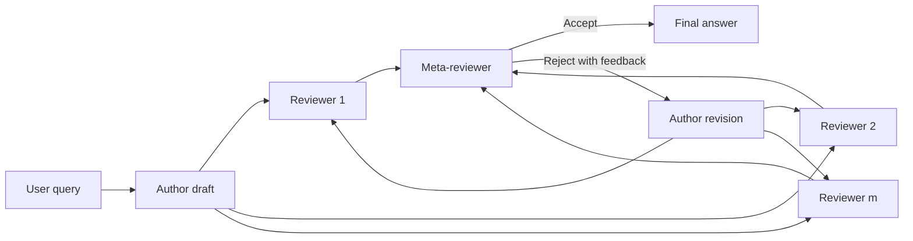

# MARS: toward more efficient multi-agent collaboration for LLM reasoning

## Source report

[[reports/mars/report|MARS: toward more efficient multi-agent collaboration for LLM reasoning report]]

## Related knowledge

- [[multi-agent-review-system|Multi-Agent Review System]]
- [[hierarchical-review-topology|Hierarchical Review Topology]]
- [[independent-reviewer|Independent Reviewer]]
- [[meta-reviewer|Meta-Reviewer]]
- [[propose-review-feedback-update|Propose–Review–Feedback–Update]]
- [[sequence-level-log-probability-confidence|Sequence-level Log-probability Confidence]]
- [[over-correction|Over-correction]]
- [[inference-time-collaboration|Inference-time Collaboration]]
- [[chain-of-thought-authoring|Chain-of-Thought authoring]]
- [[independent-reviewer-verification|Independent reviewer verification]]
- [[centralized-meta-review|Centralized meta-review]]
- [[average-token-log-probability-reliability|Average token log-probability reliability]]
- [[prompt-based-rebuttal|Prompt-based rebuttal]]
- [[heterogeneous-role-assignment|Heterogeneous role assignment]]
- [[gpqa|GPQA]]
- [[mmlu|MMLU]]
- [[gsm8k|GSM8K]]
- [[llm-multi-agent-reasoning|LLM multi-agent reasoning]]
- [[multi-agent-communication|multi-agent communication]]
- [[inference-time-verification|inference-time verification]]
- [[review-systems|review systems]]
- [[token-efficiency|token efficiency]]
- [[training-free-collaboration|training-free collaboration]]

## Generated synthesis (draft)

# MARS: Toward More Efficient Multi-Agent Collaboration for LLM Reasoning

> [!summary] 一句话结论
> MARS 用“作者—独立审稿人—元审稿人—作者修订”的星形层级结构替代多智能体圆桌辩论，在不训练模型的情况下，把 reviewer-to-reviewer 的全连接通信改成一次集中汇总。三类 benchmark、五种 LLM 的 100 题子集实验显示，它通常以接近或优于 MAD 的准确率把 token 降低约一半；但置信度校准没有被独立验证，当前代码也没有实现论文所称的 reviewer 并行与接受后提前停止。

## 论文信息

- 作者：Xiao Wang, Jia Wang, Yijie Wang, Pengtao Dang, Sha Cao, Chi Zhang
- 时间：2025 年 9 月，arXiv:2509.20502（当前 PDF 为 v2，preprint）
- 原文：https://arxiv.org/abs/2509.20502
- 官方代码：https://github.com/xwang97/MARS
- 代码核对版本：`37c5386b15c9b4f2b4aa464f2cf0ee4ad440448e`（2026-03-13）
- 代码状态：MIT License，包含 Pipeline、prompt、数据子集与评测脚本；README 与当前函数签名存在少量漂移。

## 研究问题

Multi-Agent Debate（MAD）让多个 Agent 分别解题，再在每一轮读取其他 Agent 的完整回答并互相修订。它能引入外部反馈，却让通信量随 Agent 数与对话轮次快速增长。MARS 追问：**是否真的需要每个 Agent 与所有其他 Agent 直接交流，还是可以用层级式 review 汇总，在保留纠错收益的同时显著减少 token 和延迟？**

论文的核心主张是 **“direct communication among all agents is unnecessary for effective collaboration”**。它并没有发明新的推理模型，而是重新设计推理期角色、消息方向和停止条件，因此天然属于无需训练的系统编排方法。

## 1. 从圆桌辩论改为同行评审

Figure 1（第 3 页）同时画出四种推理结构：单模型/反思、自洽采样、MAD 和 MARS。MAD 是对称全连接结构；MARS 是一个有中心汇聚节点的有向流程：



三种角色的职责不是“换 persona”这么简单。

- **Author** 负责产生完整 reasoning trajectory 与最终答案，是系统能力上限和最终输出责任主体。
- **Reviewer** 不直接与作者争论，也不读取其他 reviewer；它先独立重做问题，再给出 right/wrong、解释与置信度。
- **Meta-reviewer** 同时读取作者答案和所有 review，自己判断证据而不是简单多数投票；若拒绝，生成一份去重、解决冲突后的反馈。

这种拓扑把 $m$ 个 reviewer 的相互通信从潜在的 $O(m^2)$ 消息关系降为 $O(m)$：作者广播一次、reviewer 向 meta 汇总一次、meta 只向作者反馈一次。真正节省的不是 reviewer 的“思考”，而是避免每个 reviewer 在后续轮次重复读取其他所有人的长推理。

## 2. 四阶段算法

给定第 $i$ 个问题 $x_i$，作者先生成推理步骤 $t_i$ 和答案 $y_i$：

$$
t_i,y_i=\mathcal A(x_i).
$$

人话解释：MARS 要求显式 CoT，是因为 reviewer 不只核对最终选项，还要定位中间推理中的错误。这个设计提升可审查性，也意味着论文依赖可见 reasoning trace；对于不提供完整思维链的现代 API，需要改成简短可验证 rationale 或结构化证据。

第 $j$ 个 reviewer 独立审查：

$$
r_{ij}=\mathcal R_j(x_i,t_i,y_i),\qquad j=1,\ldots,m.
$$

$r_{ij}$ 包含 decision、confidence 和 justification。Appendix E.1.2（第 13–14 页）的 prompt 明确要求 reviewer 先忽略作者答案、自行重做，再比较选项。这一点很重要：如果只让模型“找错”，它容易接受作者锚定或制造不存在的问题。

元审稿人将所有 review 拼接为 $r_i=r_{i1}\oplus\cdots\oplus r_{im}$，输出决策与反馈：

$$
m_i=\mathcal M(x_i,t_i,y_i,r_i).
$$

Appendix E.1.4 要求 meta-reviewer **“Do not only rely on the reviewers, you must also think by yourself.”** 因而 meta 既是聚合器，也是额外 verifier。它被提示按论证质量和可靠性权重判断，而非只数 right/wrong 票数。

若拒绝，作者根据自己的原推理和 meta 反馈修订：

$$
y_i^*=\mathcal A(t_i,y_i,m_i).
$$

Appendix E.1.5 还要求作者只有在强烈同意反馈时才修改，否则坚持原答案。这是对 over-correction 的软防护：错误 reviewer 不应自动推翻正确答案。

Algorithm 1（第 12 页）给出的停止条件是：

$$
\text{while decision=Reject and }k\le K,
$$

一旦 meta 接受就 `break`，否则最多修订 $K$ 次。理论上，容易问题只需一次 author + reviews + meta，难题才支付修订成本。

## 3. Reviewer confidence：名字叫校准，证据还不够

Reviewer 的自然语言“Confidence: 1–5”容易过度自信。MARS 另外读取 API 返回的 token log probability。若 review 由 $N$ 个 token 构成，平均对数概率为：

$$
\mathrm{AvgLogProb}_{ij}=\frac{1}{N}\sum_{k=1}^{N}\log P(t_k).
$$

再指数化得到 0–1 分数：

$$
\mathrm{Conf}_{ij}=\exp(\mathrm{AvgLogProb}_{ij}).
$$

分数越接近 1，表示模型对自己生成的整段 review 序列平均越“顺手”。官方实现确实请求 `logprobs=True`，并计算均值后指数化：

```python
# custom_agents.py:61-88
token_logprobs = [
    t.logprob for t in response.choices[0].logprobs.content
    if t.logprob is not None
]
avg_logprob = np.mean(token_logprobs)
confidence_score = np.exp(avg_logprob)
```

但这不是严格意义上已经验证的 correctness calibration。平均整段 logprob 会受措辞、长度、格式和模型语言习惯影响，不等同于“Decision: right/wrong”正确的概率。论文没有报告 ECE、Brier score、AUROC，也没有比较“无 reliability score”“口头 1–5”“decision-token 概率”“整段平均概率”的下游准确率。因此它更准确的名称应是 **sequence-likelihood reliability heuristic**。

## 4. 为什么 token 大幅下降

假设有 $n$ 个 MAD Agent、两轮推理。第一轮每人生成答案；第二轮每人都要读取其他 $n-1$ 条完整答案并再生成一次。消息被重复放进多个 prompt，密集拓扑让输入 token 近似二次增长。

MARS 的 reviewer 只读取同一份 author draft，meta 只读取 $m$ 份较短 review，作者只读取 meta 的单份归纳反馈。reviewer 不互读，作者也不直接消化多份可能冲突的意见。因此 token 复杂度对 reviewer 数更接近线性。

Figure 3（第 8 页）从 3 到 6 个总 Agent 比较 MARS 与 MAD。GPT-3.5 和 GPT-4o-mini 上，MARS token 曲线近似线性缓升，而 MAD 上升更快；准确率则没有因稀疏通信而下降。这个结果支持结构性论点：对“验证一个候选答案”这种任务，星形 review 比全连接 debate 更匹配信息流。

## 5. 主实验：约一半 token，准确率总体可比

实验在 GPQA、MMLU、GSM8K 上各随机抽 100 题，每个设置平均 3 次。模型包括 GPT-3.5-turbo、GPT-4o-mini、Mixtral-8x7B、Mixtral-8x22B、Llama-3.3-70B。主设置使用相同总 Agent 数比较 MARS 与 MAD，并在初始轮后进行一轮更新。

### 表 1：GPQA 的准确率与平均 token

| Backbone | MAD Acc./Tok. | MARS Acc./Tok. | Token 降幅 |
|---|---:|---:|---:|
| GPT-3.5 | 31.00 / 7,567 | 36.33 / 3,741 | 50.6% |
| GPT-4o-mini | 47.50 / 17,083 | 48.33 / 7,903 | 53.7% |
| Mixtral-8x7B | 35.67 / 12,835 | 37.33 / 6,441 | 49.8% |
| Mixtral-8x22B | 47.00 / 13,308 | 44.00 / 5,418 | 59.3% |
| Llama-3.3-70B | 59.67 / 19,255 | 60.00 / 6,633 | 65.6% |

Table 1（第 6 页）证明 token 降幅在不同 provider/model 上相当稳定，这是论文最强的证据。准确率则不能概括为 MARS 全胜：Mixtral-8x22B 的 GPQA 从 MAD 47.00 降为 44.00，差 3 题；其余四个 backbone 持平或提升。换句话说，MARS 的优势首先是 Pareto 效率，而不是无条件更准。

### 表 2：跨任务的代表结果

| 设置 | MAD Acc./Tok. | MARS Acc./Tok. | 解读 |
|---|---:|---:|---|
| GPT-4o-mini, MMLU | 85.33 / 8,338 | 85.67 / 4,210 | 准确率持平，token 约减半 |
| GPT-4o-mini, GSM8K | 97.67 / 7,440 | 98.00 / 3,389 | 高饱和任务仍保持效果 |
| GPT-3.5, GSM8K | 79.00 / 4,355 | 75.67 / 2,508 | 节省 token，但少答对约 3 题 |
| Mixtral-8x22B, GSM8K | 87.00 / 6,805 | 90.33 / 3,515 | 更省且多答对约 3 题 |
| Llama-3.3-70B, MMLU | 84.00 / 9,370 | 84.67 / 4,210 | 约 55% token 降幅 |

论文每个设置只有 100 题、3 次平均，没有给标准差或显著性检验。1–3 个百分点变化处在少数样本量级，不能据此断言某架构在准确率上稳定优越；但 40%–66% 的 token 差距量级很大，且跨 15 个 model-task 设置一致，效率结论明显更强。

Figure 2（第 7 页）把 GPQA 的 accuracy-token 点画在一起：MARS 相对 MAD 平均 token 分别下降约 54%（GPT-4o-mini）和 66%（Llama-70B），准确率略高。图形表达合理，但“+8% Avg. acc”是相对百分比而非百分点，阅读时不要误解为多 8 道题。

## 6. 延迟：报告有效，公开实现仍有并行空间

Table 4（第 13 页）报告 MARS 相对 MAD 通常降低 30% 以上延迟。例如：

| 设置 | MAD 秒/题 | MARS 秒/题 | 降幅 |
|---|---:|---:|---:|
| GPT-4o-mini, GPQA | 85.67 | 49.02 | 42.8% |
| Llama-70B, GPQA | 104.25 | 49.77 | 52.3% |
| GPT-4o-mini, MMLU | 41.58 | 28.14 | 32.3% |
| Mixtral-8x22B, GSM8K | 23.55 | 16.23 | 31.1% |

有一个反例：Mixtral-8x7B 的 GPQA 是 79.24 秒，几乎等于 MAD 79.33 秒。API 排队、provider 吞吐和输出长度都会影响 wall-clock，所以延迟结论没有 token 结论稳定。

论文多次称 reviewer 可并行，但当前官方 `run_mars_pipeline` 用普通 `for` 循环逐个同步调用：

```python
# pipelines.py:54-93
review_responses = []
for i, reviewer in enumerate(reviewers):
    review_response_dict = reviewer.run(reviewer_histories[i])
    review_content = review_response_dict["content"]
    review_responses.append(review_content)
```

因此公开实现没有利用 reviewer 的天然并行性。若用 `asyncio.gather` 或并发 API 请求，交互延迟理论上可接近最慢 reviewer 加 meta/author，而不是所有 reviewer 延迟之和；这可能使生产版本比论文表格更快，但也会遇到 rate limit 和吞吐配额。

## 7. 异构角色：强 reviewer 有用，强 author 更重要

Table 2（第 7 页）在 GPQA 上混合 GPT-3.5 与 Mixtral-8x22B。作者总结三点。

第一，弱 GPT author 配强 Mixtral reviewer/meta，准确率从约 35.33 提至最高 39.00。第二，author 决定能力上限：最弱的 Mixtral-author 组合 41.67 仍高于所有 GPT-author 组合。第三，模型多样性不等于“各角色越强越好”：Mixtral author + 两个 GPT reviewer + GPT meta 达到 46.40，超过全 Mixtral。

这个实验提示一种实用成本分配：把最强模型放在 author，reviewer 可用更便宜但错误模式不同的模型，meta 根据风险选中等或强模型。可惜每个组合只在 GPQA 100 题上评估，没有 token/价格表，也没有系统搜索角色分配，46.40 可能包含抽样和随机性。

## 8. Persona 实验的反直觉结果

作者给 reviewer 加 conservative/aggressive persona，期望人为制造认知多样性。Table 3（第 8 页）显示 persona 除少量 MMLU 设置外普遍无益，甚至使 GPT-3.5 GPQA 从 36.33 降至 34.00、Mixtral-8x22B MMLU 从 77.67 升/降至 80.00（少数提升）。

作者的解释是 temperature 带来的自然随机性已经提供差异，而 aggressive reviewer 即使作者正确也会强行寻找漏洞，造成 noisy feedback 和 over-correction。这一发现比“多角色更好”的常见叙事更有价值：**角色多样性只有在对应不同证据源、工具或专业能力时才可靠；只改人格形容词可能制造无效冲突。**

## 9. 论文算法、实验设置与当前代码并不完全一致

Algorithm 1 规定 meta 接受即终止。然而 Appendix C 又说 MARS 与 MAD 都在初始轮后运行一轮 update，用于公平比较。2026-03 的当前代码进一步明确：

```python
# pipelines.py:107-129
decision = extract_meta_decision(meta_decision).lower()
if decision == "right":
    full_history["final_status"] = "accepted"
    # DO NOT BREAK here. We continue to max_rounds.
if round_idx < max_rounds:
    feedback_input = self.templates.construct_feedback_prompt(
        meta_decision, status=decision
    )
    author_rebuttal = author.run(author_history)
```

也就是说，即使首轮已判正确，代码仍让 author 做 robustness check，再让 reviewer 审一轮。这与“accept early stop”不同，也会增加 token。报告结果究竟使用哪一版实现，论文没有代码 commit 对应表；当前仓库提交晚于论文首版，可能是后续重构。复现时应明确选择：

- **论文算法模式**：接受即停，成本最低，但不同问题调用数不同；
- **主实验公平模式**：固定一轮 update，使 MARS/MAD调用轮数更可比；
- **当前代码稳定模式**：无论对错都复核两轮，可能降低偶然接受，但成本更高。

README 也有可见漂移：示例调用返回新结构 `rounds/final_answer`，但 README 仍读取旧键 `author_response/author_rebuttal`；评测示例写 `eval_marvel`，实际函数是 `eval_mars`。这不影响方法思想，却意味着不能直接复制 README 就期待无修改运行。

## 10. 放回《Five Ws》框架

| Five Ws | MARS 的回答 | 设计含义 |
|---|---|---|
| Who/Whom | Author 广播给多个 reviewer；reviewer 只发给 meta；meta 只反馈 author | 用星形层级代替全连接对话，通信边从近二次降到线性 |
| When | Author 完成后并行 review，meta 聚合；拒绝后才修订，理论上接受即停 | event-driven 的 review gate；当前代码则固定复核 |
| What | 完整解题轨迹、独立重做、二元决策、解释、可靠性分数、合并反馈 | 信息类型结构化，比自由辩论更可控 |
| Why | 外部纠错，同时避免 reviewer 之间重复交换长答案 | 主要优化 accuracy-resource Pareto，而非追求开放式讨论 |
| How | prompt-defined roles + centralized meta-review + optional revision | 纯推理期编排，不更新模型参数 |

MARS 最适合“先有候选产物，再审查是否正确”的任务：数学/科学问答、代码审查、研究报告事实核验、方案评审。它不适合需要多个 Agent 共同探索尚无候选解的任务；此时 reviewer 全部围绕同一 author anchor，可能一起错过替代方向。

## 11. 无需训练的落地建议

最低配实现只需现成 LLM API，不需要 fine-tuning、RL、训练 verifier 或向量数据库。

1. 用一个强 author 生成结构化草稿：结论、依据、可检查中间结果和引用。
2. 配 2 个 reviewer，要求先独立求解/检查，再比较 author；工具或证据源应不同，而不只是 persona 不同。
3. reviewer 输出固定 JSON：`decision`、`confidence`、`issues[]`、`evidence[]`、`suggestion`。
4. 并发执行 reviewer；不要照官方同步循环。
5. meta 根据证据质量聚合，不能只投票；高风险任务应接入规则、测试或检索证据。
6. 首轮全体接受且无高风险警报时提前停止；拒绝时只把 meta 去重后的 actionable feedback 发给 author。
7. 记录纠错率、误改率、首次接受率、每角色 token、端到端延迟与单题成本。

用于 PR review 时，可以让 author 是实现 Agent，reviewer 分别运行测试/静态分析、安全检查和需求核对，meta 只合并有文件行号或命令输出支持的问题。这样“独立 reviewer”来自独立工具证据，而非同一模型随机采样，可靠性会比论文的纯文本 benchmark 更强。

## 局限与风险

- 作者自述：token 概率置信度并未解决 LLM calibration；当前 heuristic 没有独立校准指标或消融。
- 作者自述：meta 的负面反馈可能推翻正确初稿，导致 over-correction；“不同意就坚持”只是 prompt 防护，没有形式保证。
- 作者自述：实验最多两轮，没有系统研究更多 review/revision 对准确率和成本的影响。
- 100 题、3 次平均足以显示大幅 token 差异，但对 1–3 个百分点的准确率差异统计力度有限；论文未报告方差、置信区间或检验。
- 所有 reviewer 往往使用相同模型、相同 prompt 和同一 author anchor，错误高度相关；人数增加不等于独立证据增加。
- meta 是单点故障和权力中心：它可能忽略少数正确 reviewer，或受 author/reviewer 中的 prompt injection 影响。
- 显式 CoT 增加 token，并不适用于所有 API/隐私环境；生产系统应改用可验证摘要、工具证据或结构化 rationale。
- 论文称 reviewer parallel，公开代码却同步顺序调用；论文 Algorithm 1 与当前固定二轮实现的停止行为不同。
- 当前代码默认 temperature=1 且每次随机 seed，复现需要保存具体 seed 和原始 response；README 示例与代码接口有漂移。
- benchmark 都是封闭答案推理；软件工程、长文研究、工具使用等开放任务上的正确性判断和停止条件尚未验证。

## 结论

MARS 最可靠的发现不是“模拟同行评审更像人”，而是一个信息架构原则：**当任务目标是验证已有候选时，独立检查加集中汇总通常比所有人互相辩论更经济。** 论文跨模型、跨任务的一致 token 降幅支持这一点，且整个方案无需训练，适合快速接入现有 Agent workflow。

它仍不是可靠性银弹。reviewer 共享偏差、meta 单点误判、置信度未经校准、停止条件版本不一致，都说明生产实现必须引入独立工具证据、真正并发、结构化输出和误改率监控。把这些补上后，MARS 比传统多轮 MAD 更接近可运营的多智能体审查管线。

## 关键概念

- Multi-Agent Review System
- Hierarchical Review Topology
- Independent Reviewer
- Meta-Reviewer
- Propose–Review–Feedback–Update
- Sequence-level Log-probability Confidence
- Over-correction
- Inference-time Collaboration

## 开放问题

- 哪些问题应首轮接受即停，哪些需要固定复核或更多轮？能否基于风险/不确定性自适应决定？
- 如何用 reviewer 的 decision-token 概率、历史正确率与工具证据替代整段平均 logprob？
- 相同模型的多个随机 reviewer 与不同模型/不同工具 reviewer，谁提供更高的边际纠错价值？
- meta 单点错误如何被检测？是否需要少数意见保留、规则 veto 或二级 meta？
- 在同一美元成本而非相同 Agent 数下，MARS 与 self-consistency、best-of-N、MAD 的 Pareto 前沿如何变化？
- 开放式代码/研究任务中，怎样定义 accept/reject 和可自动验证的 feedback？

## 证据定位

- Figure 1（第 3 页）：单 Agent、自洽、MAD 与 MARS 拓扑对比。
- Equations (1)–(4)（第 4 页）：author、reviewer、meta 和 rebuttal 四阶段。
- Equations (5)–(6)（第 4–5 页）：整段 token logprob 可靠性分数。
- Table 1（第 6 页）：五模型、三 benchmark 的准确率与 token 主结果。
- Figure 2 与 Table 2（第 7 页）：accuracy-token Pareto 与异构角色组合。
- Figure 3、Table 3（第 8 页）：Agent 数扩展与 persona 消融。
- Appendix A、Algorithm 1、Appendix C（第 11–12 页）：作者局限、提前停止算法与实验轮数说明。
- Table 4（第 13 页）：平均推理时间。
- Appendix E（第 13–16 页）：完整角色与 baseline prompts。
- Tables 5–6（第 17–18 页）：纠错成功与 reviewer 冲突裁决案例。


## User notes
