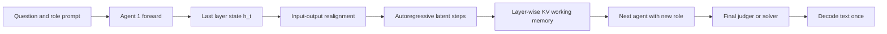

# Latent Collaboration in Multi-Agent Systems

## Source report

[[arxiv-2511-20639]]

## Related knowledge

- [[latent-thoughts|Latent Thoughts]]
- [[latent-working-memory|Latent Working Memory]]
- [[kv-cache-transfer|KV-cache Transfer]]
- [[input-output-distribution-alignment|Input-Output Distribution Alignment]]
- [[continuous-space-multi-agent-collaboration|Continuous-space Multi-Agent Collaboration]]
- [[training-free-inference-time-architecture|Training-free Inference-time Architecture]]
- [[autoregressive-hidden-state-feedback|Autoregressive Hidden-state Feedback]]
- [[linear-embedding-realignment|Linear Embedding Realignment]]
- [[layer-wise-kv-cache-sharing|Layer-wise KV-cache Sharing]]
- [[sequential-mas|Sequential MAS]]
- [[hierarchical-mas|Hierarchical MAS]]
- [[parallel-text-debug-probe|Parallel Text Debug Probe]]
- [[arc-easy|ARC-Easy]]
- [[arc-challenge|ARC-Challenge]]
- [[gsm8k|GSM8K]]
- [[medqa|MedQA]]
- [[mbpp|MBPP+]]
- [[humaneval|HumanEval+]]
- [[aime-2024|AIME 2024]]
- [[aime-2025|AIME 2025]]
- [[gpqa-diamond|GPQA-Diamond]]
- [[llm-multi-agent-systems|LLM Multi-Agent Systems]]
- [[latent-reasoning|Latent Reasoning]]
- [[agent-communication|Agent Communication]]
- [[inference-efficiency|Inference Efficiency]]
- [[test-time-scaling|Test-time Scaling]]

## Generated synthesis (draft)

---
paper_id: arxiv:2511.20639
status: deposited
source: https://arxiv.org/abs/2511.20639
generated: true
human_confirmed: false
---

# LatentMAS：多智能体如何在“不说话”的情况下协作

## 1. 论文元信息

- 标题：Latent Collaboration in Multi-Agent Systems
- 作者：Jiaru Zou、Ruizhong Qiu、Gaotang Li、Xiyuan Yang 等
- 发表：ICML 2026 Spotlight，PMLR 306；arXiv 预印本首次发布于 2025 年
- 论文：[arXiv:2511.20639](https://arxiv.org/abs/2511.20639)
- 代码：[Gen-Verse/LatentMAS](https://github.com/Gen-Verse/LatentMAS)，Apache-2.0
- 精读依据：35 页论文全文、附录、官方 README 以及 HuggingFace 核心实现

> [!summary] 一句话总结
> LatentMAS 不再让多个 agent 把思考写成文字后互相转述，而是让每个 agent 直接生成连续隐藏向量，并把包含这些向量的逐层 KV cache 交给下一个 agent；这样免去了中间文本的解码和重新编码，但要求所有 agent 能共享兼容的模型内部表示。

## 2. 先把问题说透：TextMAS 到底浪费在哪里？

传统多智能体系统通常把自然语言当作公共通信协议。以 Planner → Critic → Refiner → Solver 为例，Planner 先生成一段完整的分析文字；Critic 读取这段文字并生成批评；Refiner 再读取前两者的文字；最后 Solver 汇总。这样做直观、可审计，也能连接不同厂商的黑盒模型，但每一次交接都要经过“隐藏状态 → 词表概率 → 离散 token → 文本 → token → 输入 embedding”的往返转换。

这不仅是速度问题。一个 agent 内部的状态是高维连续向量，而它被迫通过有限词表压缩成句子。后续 agent 得到的不是前者完整的内部计算状态，只是前者选择说出来的摘要。论文把这一点称为自然语言媒介造成的表达瓶颈，其研究问题用一句极短的原文概括就是：**“Can MAS achieve pure latent collaboration?”**（第 2 页）。

可以把 TextMAS 想成四位医生远程会诊，但医院规定每位医生只能提交一页文字报告。影像、直觉、不确定性和多个并行假设都必须先压缩成句子；下一位医生再根据句子重建自己的理解。LatentMAS 的想法是：如果四位“医生”实际上是同一类 Transformer 的不同角色，为什么不直接传递模型已经算好的内部工作记忆？

因此，这篇论文同时攻击两个瓶颈，而不只是其中一个：第一，单个 agent 的内部推理不再逐 token 生成自然语言；第二，agent 之间也不再传递文本。论文将其概括为让 **“all agents reason and communicate entirely within the latent space”**（第 3 页）。理解这一点非常重要：只做 latent reasoning、但仍用文本通信，不是完整 LatentMAS；只把文本推理的 KV cache 传给下一位，也不是完整 LatentMAS。

## 3. 必要预备知识：普通语言模型怎样生成一个词？

给定输入 token 序列 $x_{1:t}$，模型先通过输入 embedding 矩阵 $W_{in}$ 得到向量序列 $E=[e_1,\ldots,e_t]$。经过 $L$ 层 Transformer 后，最后一个位置产生末层隐藏状态 $h_t\in\mathbb{R}^{d_h}$，其中 $d_h$ 是隐藏维度。普通自回归生成使用论文公式（1）：

$$
p(x_{t+1}\mid x_{\le t})=\operatorname{softmax}(h_tW_{out}).
$$

人话解释：$h_t$ 已经是模型对“下一步应该表达什么”的连续表示；$W_{out}$ 把它投影到整个词表，softmax 再从数万个候选 token 中选一个。选出的 token 随后还要经过 $W_{in}$ 变回输入向量，才能进行下一步计算。普通生成每一步都走一次“连续 → 离散 → 连续”的环路。

Transformer 的 KV cache 则保存每一层过去位置的 Key 和 Value。生成下一步时，旧缓存不需要重算，只需追加当前步的新向量。论文公式（2）写作：

$$
K_{cache}\leftarrow[K_{\le t};K_{t+1}],\qquad
V_{cache}\leftarrow[V_{\le t};V_{t+1}].
$$

人话解释：KV cache 不是最终答案，而是每一层注意力机制可直接读取的历史工作记忆。它包含的信息比一段最终文本更贴近模型实际的计算过程。LatentMAS 的关键跃迁，就是把“单模型用来加速生成的缓存”提升为“多个 agent 之间的通信载体”。

## 4. 方法全景：一次 LatentMAS 推理究竟发生了什么？

论文 Figure 2 给出两种组织方式。Sequential MAS 使用 Planner、Critic、Refiner、Solver 串行协作；Hierarchical MAS 使用 Code、Math、Science 等领域专家，再由 Summarizer 聚合。LatentMAS 不改变这些角色或拓扑，它改变的是每个角色内部如何思考、角色之间传什么。

论文 Figure 3 是理解全文最重要的一张图。对于第一个 agent，问题和角色提示仍然是普通 token；模型对它们进行一次前向计算，得到末层隐藏状态。此后不解码 token，而是把经过对齐的末层隐藏状态作为下一步 `inputs_embeds`，连续滚动 $m$ 次。与此同时，每一步在每一层产生的 K/V 都追加到缓存。agent 结束后，整个 cache 直接成为下一 agent 的 `past_key_values`。最后一个 Solver/Judger 才恢复普通文本生成。

整条数据流可以写成：



下面逐个拆开这条链路。真正困难的地方不是“把 hidden state 传过去”，而是回答三个问题：隐藏状态能否直接当下一步输入？它是否表达了足够丰富的推理？KV cache 是否真的把前一个 agent 的信息完整带给后一个 agent？

## 5. 创新一：自回归生成 latent thoughts

设当前输入 embedding 为 $E=[e_1,\ldots,e_t]$，第一个 agent 经过 Transformer 后得到 $h_t$。LatentMAS 不计算词表概率并采样 $x_{t+1}$，而是构造新的连续输入 $e_{t+1}$，再次送入模型。重复 $m$ 次后得到：

$$
H_{latent}=[h_{t+1},h_{t+2},\ldots,h_{t+m}].
$$

人话解释：传统 CoT 的每一步是一个 token；LatentMAS 的每一步是一个 $d_h$ 维实数向量。这个向量不必对应某个可读单词，它可以同时编码多个语义方向、置信度或尚未被语言化的关系。因此作者把这些末层表示称为 latent thoughts。

论文 Theorem 3.1 试图从表达容量说明这种设计。若长度为 $m$ 的 latent thoughts 能被文本无损表达，那么所需文本 token 数至少满足：

$$
m_{text}=\Omega\!\left(\frac{d_hm}{\log|V|}\right),
$$

其中 $|V|$ 是词表大小。人话解释：一个离散 token 最多携带约 $\log|V|$ 的选择信息，而一个 $d_h$ 维连续状态的表达自由度随 $d_h$ 增长，所以等价文本往往需要许多 token。这个定理解释了为什么几十个 latent steps 可能替代数千个文本 token。

但这里必须加上理论限定。该结论依赖附录 B.1 的 Linear Representation Hypothesis，并把连续向量视为能够承载高精度信息；它不是“一个 latent step 在真实推理中必然等于数百个有效 token”的实证证明。论文给出的 235.7/377.1/471.4 倍是由维度和词表规模推导出的表达容量比，不应与端到端实际加速 4 倍混为一谈。

## 6. 创新二：为什么不能把 $h_t$ 原样塞回输入层？

末层隐藏状态 $h_t$ 与输入 embedding $e_t$ 虽然维度相同，但来自不同分布。$e_t$ 是训练得到的词向量；$h_t$ 已经过多层注意力、MLP 和残差变换。如果直接把 $h_t$ 当下一步的输入，浅层 Transformer 会接收到训练时很少见的激活，连续滚动后可能发生表示漂移。

论文因此提出无需训练的 input-output alignment，公式（3）为：

$$
e_{t+1}=h_tW_a,\qquad W_a\approx W_{out}^{\dagger}W_{in}.
$$

$W_{out}^{\dagger}$ 是输出矩阵的伪逆。其直觉是：$h_tW_{out}$ 表示 $h_t$ 在词表输出空间中的方向；再乘 $W_{in}$，相当于把这一输出语义搬回输入 embedding 的坐标系。代码实际上没有显式计算巨大伪逆，而是求解带微小正则的正规方程：

```python
# models.py:158-177
input_weight = input_embeds.weight.detach().to(dtype=torch.float32)
output_weight = output_embeds.weight.detach().to(dtype=torch.float32)
gram = torch.matmul(output_weight.T, output_weight)
reg = 1e-5 * torch.eye(gram.shape[0], device=gram.device)
rhs = torch.matmul(output_weight.T, input_weight)
realign_matrix = torch.linalg.solve(gram + reg, rhs)
target_norm = input_weight.norm(dim=1).mean().detach()
```

这段源码对应 $W_a=(W_{out}^{\top}W_{out}+\lambda I)^{-1}W_{out}^{\top}W_{in}$。矩阵每个模型只构造一次，之后所有 latent steps 复用，因此论文称其 training-free：没有数据集优化、反向传播或新增可学习参数。

实现还增加了论文正文容易被忽略的范数校正：

$$
\tilde e_{t+1}=e_{t+1}\frac{\bar r_{in}}{\lVert e_{t+1}\rVert_2},
$$

其中 $\bar r_{in}$ 是模型输入 embedding 的平均范数。人话解释：线性映射负责纠正方向和坐标系，范数校正负责把向量长度拉回正常输入的量级，避免连续回灌时数值越来越大或越来越小。

Figure 6 展示 Qwen3-4B/14B 上的分布投影：未经对齐的 $h_t$ 明显偏离输入 embedding，经过 $W_a$ 的 $e_{t+1}$ 回到输入分布附近。Figure 7 更重要，因为它给出下游因果证据：打开 alignment 后，ARC-C、ARC-E、GSM8K 的准确率分别提升约 2.3–5.3 个百分点。这说明对齐不是为了让图好看，而是直接影响多步 rollout 是否稳定。

## 7. 创新三：KV cache 如何变成跨 agent 工作记忆？

完成 $m$ 个 latent steps 后，第一个 agent 在每一层都拥有包含“原始问题、角色提示和新 latent thoughts”的缓存。论文公式（4）把它定义为：

$$
M_{A_1}=\left\{\left(K^{(l)}_{A_1,cache},V^{(l)}_{A_1,cache}\right)\right\}_{l=1}^{L}.
$$

人话解释：$M_{A_1}$ 不是一个单独向量，而是一整套按层组织的历史。下一 agent 在自己的每一层注意力中，都能把前一个 agent 的 K/V 当作前文来关注。这比只传最后一个 hidden state 更完整，也避免重新计算前一个 agent 的所有上下文。

官方实现把这一过程写得非常直接：非最终 agent 调用 `generate_latent_batch`，并把返回的 `past_kv` 原封不动交给循环中的下一个 agent；最终 judger 才调用文本生成。

```python
# methods/latent_mas.py:109-135, 156-184
if agent.role != "judger":
    past_kv = self.model.generate_latent_batch(
        wrapped_ids,
        attention_mask=wrapped_mask,
        latent_steps=self.latent_steps,
        past_key_values=past_kv,
    )
else:
    generated_batch, _ = self.model.generate_text_batch(
        judger_ids,
        judger_mask,
        past_key_values=past_kv,
    )
```

而 `generate_latent_batch` 内部的循环正好对应 Figure 3：先对齐末层状态，再通过 `inputs_embeds` 回灌，同时不断扩展 cache。

```python
# models.py:321-348
for step in range(latent_steps):
    latent_vec = self._apply_latent_realignment(last_hidden, source_model)
    latent_embed = latent_vec.unsqueeze(1)
    outputs = self.model(
        inputs_embeds=latent_embed,
        past_key_values=past,
        use_cache=True,
        output_hidden_states=True,
    )
    past = outputs.past_key_values
    last_hidden = outputs.hidden_states[-1][:, -1, :]
```

论文 Theorem 3.3 将这一机制描述为信息保持：在其形式化设定中，后续 agent 读取 latent working memory，与直接获得前序输出可产生等价结果。这里的“lossless”应谨慎理解为计算图和缓存传递层面的信息不再经过文本压缩，而不是说不同模型、不同 tokenizer 或不同架构之间的语义必然无损。

## 8. 完整系统为什么更快？不要把 token 数当成全部计算量

Theorem 3.4 给出单个 LatentMAS agent 的复杂度：

$$
T_{latent}=O\!\left((d_h^2m+d_hm^2+d_htm)L\right),
$$

其中 $t$ 是输入长度，$m$ 是 latent step 数，$L$ 是层数。文本 MAS 除 Transformer 计算外，还要对大量步骤执行词表投影与 softmax，并需要更多离散步骤才能达到理论上相同的表达容量。

不过，更可信的指标不是“系统输出 token”本身，而是论文测得的端到端时间。latent step 虽然不计作输出 token，仍然需要一次 Transformer 前向传播；因此“减少 80% 输出 token”不代表“减少 80% FLOPs”。论文 Figure 4 报告的 4.0 倍 sequential 加速和 hierarchical 设置的 4.3 倍加速，才是更接近实际部署成本的证据。

## 9. 实验设计：作者到底比较了什么？

实验覆盖 9 个 benchmark：ARC-Easy、ARC-Challenge、GSM8K、MedQA、MBPP+、HumanEval+、AIME24、AIME25 和 GPQA-Diamond。模型包括 Qwen3-4B/8B/14B，以及附录中的 Llama3-3B/8B。比较对象是单模型、相同拓扑的 TextMAS 和 LatentMAS。

所有配置采用 temperature 0.6、top-p 0.95，并报告三次独立运行的均值。latent steps 从 $\{0,10,20,40,80\}$ 中按任务和模型调节。论文主实验使用 8×NVIDIA A100-80G。这个设置说明“无需训练”只表示不更新参数，并不表示无需超参数选择或可以在普通笔记本上低成本运行。

### 9.1 Sequential MAS 的代表性结果

下表从论文 Table 1 中选取 Qwen3-8B 的代表任务。速度是论文报告的每次运行总秒数，因此数值越低越好。

| 任务 | 指标 | Single | TextMAS | LatentMAS | 相对 TextMAS |
|---|---:|---:|---:|---:|---:|
| GSM8K | Accuracy | 81.1 | 92.3 | **93.8** | +1.5 pp |
| GSM8K | Output token | 1280 | 2324 | **860** | −63.0% |
| GSM8K | Time | 449 | 1739 | **543** | 3.2× |
| MBPP+ | Accuracy | 64.8 | 69.5 | **74.6** | +5.1 pp |
| MedQA | Accuracy | 53.0 | 75.0 | **75.3** | +0.3 pp |

这张表需要分两层读。第一层，效率收益非常稳定：LatentMAS 在所有主表任务上都显著少于 TextMAS 的输出 token，并大幅缩短运行时间。第二层，准确率提升并非处处巨大；例如 Qwen3-8B 的 MedQA 只比 TextMAS 高 0.3 pp，ARC-E 和 ARC-C 甚至分别低 0.3、0.2 pp。因此“最高 +14.6%”主要指相对单模型的系统收益，不等于每个任务都比强 TextMAS 高 14.6 pp。正文给出的相对 TextMAS 平均提升是 sequential 2.8%、hierarchical 4.6%。

### 9.2 推理密集任务

论文 Table 2 显示，在 AIME24/25 和 GPQA-Diamond 上，LatentMAS 的效率优势尤其明显。例如 Qwen3-8B sequential GPQA-Diamond 从 TextMAS 的 17,986 个系统输出 token 降到 4,571，运行时间从 5,771 秒降到 854 秒，同时准确率从 43.4 提升到 45.5。这里最有说服力的不是 2.1 pp 本身，而是它在大幅压缩可见推理轨迹后没有损失准确率。

作者还在附录 Table 5 单独统计最终 agent 的输出长度。LatentMAS 的最终解码平均也缩短 29.1%，说明节省不只来自“中间 agent 不说话”：最终 Solver 读取 latent memory 后，也更少需要重新复述前面的推理。

## 10. 最关键的因果证据：究竟是 latent reasoning 还是 latent communication 有用？

只看主表无法判断收益来源。可能只是少输出文字，可能只是 KV cache 更高效，也可能只是某个 prompt 更好。附录 Table 7 的混合消融因此比总榜单更关键：

| 方法（Qwen3-8B） | GSM8K | MBPP+ | MedQA |
|---|---:|---:|---:|
| Latent reasoning + 文本通信 | 85.5 | 66.4 | 65.9 |
| 文本推理 + Latent communication | 90.1 | 68.0 | 71.2 |
| **完整 LatentMAS** | **93.8** | **74.6** | **75.3** |

第一行说明：即使 agent 内部使用 latent thoughts，一旦把它截断或解码为文字交给下一个 agent，优势会明显下降。第二行说明：即使保留文本推理，只要用 latent memory 传递信息也有帮助，但仍不及完整方案。完整 LatentMAS 在三个任务上全部最好，支持作者的核心主张：连续推理的表达能力与连续通信的信息保真是互补的，而不是同一效果的两种说法。

输入输出对齐的消融同样重要。Figure 6 只提供分布可视化，Figure 7 则显示对齐带来 2.3–5.3 pp 的实际准确率提升。两者结合，构成“机制观察 + 下游结果”的证据链。

Figure 8 考察 latent depth。Qwen3-14B 在三个任务上通常随步骤增加而提高，并在 40–80 步附近达到最佳；继续到 160 步会平台或下降。这意味着 latent thinking 不是越长越好。连续状态同样可能累积漂移、冗余或错误，只是它没有以可读废话的形式显现出来。

## 11. Latent thoughts 真的“有语义”吗？

Figure 5 把 LatentMAS 的末层向量与 TextMAS 生成 token 的 embedding 投影到同一空间。两者覆盖相近区域，且 LatentMAS 分布更广。附录 Table 6 使用平均两两余弦相似度衡量多样性：Qwen3-4B/8B/14B 上，LatentMAS 分别为 0.104/0.093/0.108，低于 TextMAS 的 0.126/0.142/0.155。作者据此认为 latent thoughts 既与文本语义区域一致，又更不容易坍缩。

但“投影分布重合”不能证明每个 latent vector 都对应一个正确、清晰的命题。较低的余弦相似度也可能意味着更多变化，而不必然意味着更多有效推理。最稳妥的结论是：实验没有发现 latent rollout 迅速离开文本语义区域，而且多样性指标支持它保留了更丰富的变化；这比“模型在隐空间里使用一种可翻译的秘密语言”更严谨。

作者设计了 debug mode：每个 agent 在相同上下文中，一边产生真正传递给后续 agent 的 latent thoughts，一边生成文本作为探针。在 100 个 Qwen3-14B GSM8K 样本中，最终答案正确的 80 例里，77 例探针文本也正确；最终错误的 20 例里，18 例探针文本包含错误，见附录 Table 8。

这个相关性很强，但论文原文所说的 **“parallel text response serves as a probe”**（第 26 页）也揭示了限制：探针与 latent thoughts 共享上下文，却不是对 latent vector 的可逆解码。因此它能帮助定位错误，不能证明文本逐句忠实表达了真实 latent computation。

## 12. “Training-free”具体意味着什么，又不意味着什么？

它意味着：不需要为 agent 通信收集配对数据；不训练 projector；不微调 LLM；$W_a$ 直接由现有的 $W_{in}$ 和 $W_{out}$ 计算；所有角色使用推理时的 prompt 和缓存完成协作。这一点相较许多需要学习跨模型适配器的 latent communication 工作，确实显著降低了方法门槛。

它不意味着：可以把 OpenAI、Anthropic 或其他只暴露文本 API 的模型直接拼起来。官方代码要求 `get_input_embeddings()`、`get_output_embeddings()`、`output_hidden_states=True`、`inputs_embeds` 和 `past_key_values`。这些都是本地白盒模型接口。

它也不意味着真正解决了异构多智能体协作。论文虽然使用多个角色和不同规模的 backbone 做实验，但主流程通常在一次运行中让同一模型承担多个角色，从而天然共享 tokenizer、层数、hidden size 和 KV 格式。若 Agent A 是 Qwen、Agent B 是 Llama，二者的 K/V 层数、注意力头和位置编码未必兼容，现有 cache 不能直接交接。

## 13. 理论声明应当怎样读？

论文最强的三个词是 expressive、lossless 和 efficient。它们都有形式化支撑，但必须连同假设阅读。

“Expressive”来自 Theorem 3.1：连续表示的容量随 $d_h$ 增长，等价文本至少需要更多离散 token。这是容量下界，不是推理正确率保证。高维向量能够表达更多，也能够携带更多噪声。

“Lossless”来自 Theorem 3.3：缓存保存前序计算中已经产生的 K/V，后续 agent 无需把文本重新编码，因此不会发生文本化压缩。它不保证模型理解正确，也不保证跨不同模型空间无损。

“Efficient”来自 Theorem 3.4 和端到端实验。理论比较依赖“达到相同表达能力”所需文本长度的估计；真实系统结论则应以 Figure 4 和 Table 1/2 的时间为准。论文测到约 4 倍加速，这是强结果，但离理论表达容量的数百倍差距很远，因为 Transformer latent rollout 本身仍需要前向计算。

## 14. 代码可复现性审计

官方仓库提供 Single、TextMAS、LatentMAS 的 HuggingFace 运行路径、两种拓扑、九个数据加载器、vLLM 混合路径以及 debug 日志。论文方法与源码的核心映射明确：`models.py::_build_latent_realign_matrix` 对应公式（3）；`models.py::generate_latent_batch` 对应自回归 latent thoughts；`methods/latent_mas.py::run_batch` 对应跨 agent cache handoff 和最终一次文本解码。

复现仍有几个工程缺口。首先，论文规模的主实验需要 8×A100-80G，并对任务/模型选择 latent steps；普通用户很难完全复刻所有表格。其次，仓库没有自动化测试。再次，当前 `run.py` 的模型 choices 重复列出 Qwen3-4B，却漏掉 README 示例中的 Qwen3-8B；混合 vLLM 路径在插入 latent embedding 的位置上显式限制 Qwen。这些问题不会推翻论文方法，但会提高“完全复现”的调试成本。

一个现实的最小复现应先选择 Qwen3-4B、GSM8K 小子集和 sequential topology，分别跑 Single、TextMAS、LatentMAS；固定采样参数，记录准确率、墙钟时间、峰值显存、最终输出 token 以及实际 latent steps。然后关闭 `latent_space_realign` 做一次配对消融。只有这样，才能区分算法收益、推理预算差异和硬件后端优化。

## 15. 独立局限分析

第一，可解释性明显退化。TextMAS 虽然啰嗦，但每个 agent 的中间轨迹可以人工检查；LatentMAS 的核心信息藏在高维 cache 中。debug probe 只是相关观测，不是忠实解释器。对于医疗、法律或需要审计的系统，这个代价可能比速度收益更重要。

第二，安全边界尚未验证。论文没有研究恶意 agent 是否能把隐蔽指令写入共享 cache，也没有测试 cache poisoning、权限隔离或不同角色之间的信息最小化。文本通信至少能被常规内容过滤器扫描，而 latent cache 的安全检测更困难。

第三，任务主要是静态问答和代码生成。论文没有覆盖长时环境交互、外部工具调用、动态反馈、多轮失败恢复，也没有展示 agent 数量从 4 个扩展到几十个时 cache 长度和注意力成本如何增长。因而它目前更像“多角色协同推理架构”，还不是通用自治智能体组织协议。

第四，实验预算并非完全等价。TextMAS 允许生成完整长 CoT，LatentMAS 使用调节后的固定 latent steps；二者内部计算单位无法由输出 token 统一度量。论文提供端到端时间缓解了这一问题，但未来还应报告 FLOPs、峰值显存、cache 大小和质量—预算曲线。

## 16. 这篇论文真正值得记住的贡献

LatentMAS 最重要的贡献不是“多调用几个角色”，而是提出一种系统级接口：让 Transformer 自己的连续状态同时承担思考语言和通信语言。过去的 latent reasoning 多集中在单模型内部，KV sharing 工作又常只解决模型间传输；本文把两者串成端到端流程，并用对齐矩阵避免隐藏状态回灌导致的分布漂移。

它也提供了一个有价值的工程判断：如果所有 agent 本质上是同一个本地模型的不同角色，那么强迫它们把内部状态翻译成人话、再让同一模型读回去，可能是一种不必要的序列化开销。此时 LatentMAS 是有吸引力的免训练集成架构。

反过来，如果系统的价值恰恰来自异构闭源模型、工具服务和可审计对话，那么自然语言仍然是兼容性最强的协议。LatentMAS 并没有消灭文本协议，而是揭示了一个新的设计分叉：同构、白盒、高吞吐的 agent 集群可以选择 latent collaboration；异构、黑盒、重审计的系统仍更适合显式通信。

## 17. 结论

从方法论上看，论文的证据链是完整的：Figure 3 说明系统机制；Figure 6/7 验证输入输出对齐；Table 7 分离 latent reasoning 与 latent communication；Figure 8 展示步数甜点区；Table 1/2 与 Figure 4 给出质量和端到端效率；Table 8 尝试处理可解释性。最可靠的结论是：在兼容的本地 Transformer 上，端到端 latent collaboration 可以在不训练新参数的情况下，保留或提高任务质量，并显著减少中间文本生成开销。

最不应被夸大的结论是“已经实现任意多智能体之间的无损隐空间通信”。现有证据主要支持同模型或高度兼容表示空间中的多角色协作。跨模型对齐、可解释性、安全隔离和长期交互，仍是这条路线真正走向通用多智能体架构之前必须解决的问题。

> [!quote] 可转述的核心判断
> LatentMAS 不是教多个模型学会一种新语言，而是让同一类模型不再反复把自己已经知道的东西翻译成人话。


## User notes
